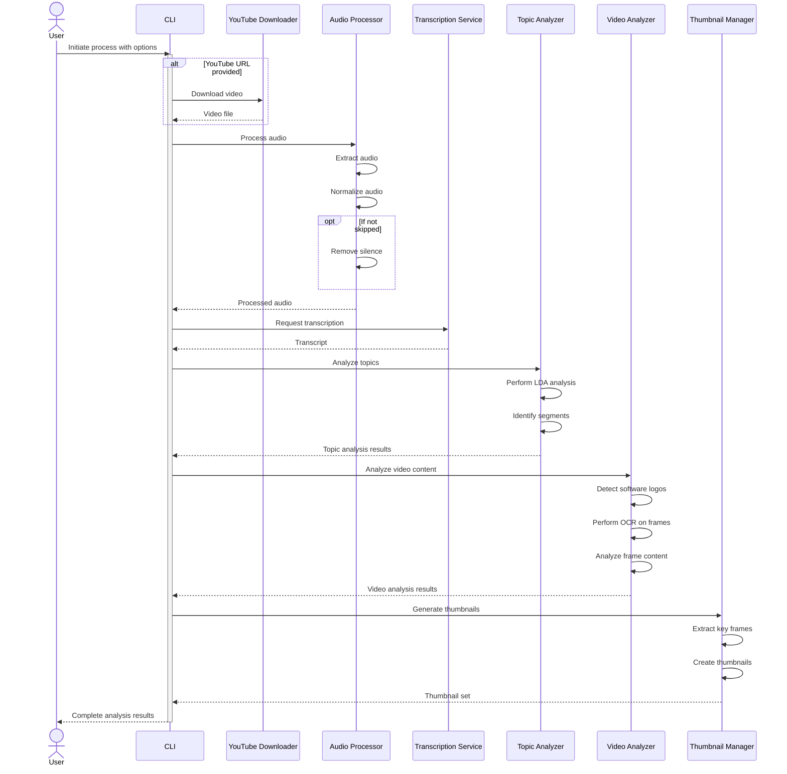
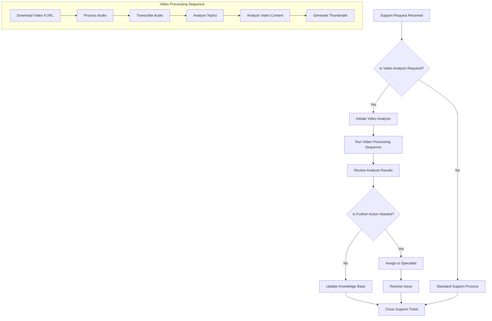

# Video Topic Splitter 🎬

A powerful AI-driven tool for intelligent video content analysis and segmentation.

## Table of Contents

- [Video Topic Splitter 🎬](#video-topic-splitter-)
  - [Table of Contents](#table-of-contents)
  - [Installation](#installation)
  - [Quick Start](#quick-start)
  - [System Architecture](#system-architecture)
  - [Tech Stack](#tech-stack)
  - [Development](#development)
  - [Project Overview](#project-overview)
  - [Use Cases](#use-cases)
    - [1. IT Technical Support Analysis](#1-it-technical-support-analysis)
    - [2. AI Agent Interaction Analysis](#2-ai-agent-interaction-analysis)
  - [Design Philosophy](#design-philosophy)
  - [Limitations](#limitations)
  - [Contributing](#contributing)
  - [License](#license)

## Installation

```bash
# Clone the repository
git clone https://github.com/yourusername/video-topic-splitter.git
cd video-topic-splitter

# Create virtual environment
python -m venv .venv
source .venv/bin/activate

# Install dependencies
pip install -e .
```

## Quick Start

Basic usage:
```bash
# Process a video file
video-topic-splitter -i your_video.mp4 -o output_segments

# Analyze with specific workflow
video-topic-splitter -i tech_talk.mp4 -o tech_insights --register it-workflow
```

## System Architecture

The system processes videos through multiple specialized components working in sequence:



## Tech Stack

- **Transcription**: Deepgram & Groq APIs for speech-to-text
- **Visual Analysis**: Google's Gemini for frame analysis
- **Topic Modeling**: OpenRouter's phi-4 model
- **Audio Processing**: FFmpeg for audio extraction and normalization
- **OCR**: Tesseract for text extraction from frames
- **Core**: Python with extensive use of async/await for performance

## Development

Support workflow integration:



## Project Overview

Video Topic Splitter is designed to transform complex video content into structured, navigable segments. It combines multiple AI technologies to understand and analyze multimedia content effectively, making it particularly valuable for technical content and educational materials.

The system provides:
- Accurate speech-to-text conversion
- Intelligent topic segmentation
- Visual content analysis
- Automated thumbnail generation
- Structured output for knowledge base integration

## Use Cases

### 1. IT Technical Support Analysis

- Detailed error diagnosis and pattern recognition
- Solution trajectory mapping
- Procedural knowledge preservation
- Diagnostic step tracking

### 2. AI Agent Interaction Analysis

- Prompt engineering pattern detection
- Model response characterization
- Interaction pattern analysis
- Performance evaluation

## Design Philosophy

The Video Topic Splitter approaches multimedia analysis through three core principles:

1. **Intelligent Segmentation**: Content is analyzed not just for transitions, but for meaningful topic boundaries and context shifts.

2. **Multi-Modal Understanding**: Combines audio transcription, visual analysis, and topic modeling for comprehensive content understanding.

3. **Knowledge Transformation**: Transforms raw video content into structured, actionable documentation and insights.

## Limitations

Current limitations of the system:

- Complex technical discussions may challenge topic boundary detection
- Visual analysis accuracy depends on video quality
- Processing time scales with video length
- Some specialized technical terminology may require domain-specific training

Version: 0.3

## Contributing

Contributions are welcome! Please feel free to submit pull requests with improvements or bug fixes.

## License

MIT License - See LICENSE file for details.

---

_Built with precision for technical content analysis_
