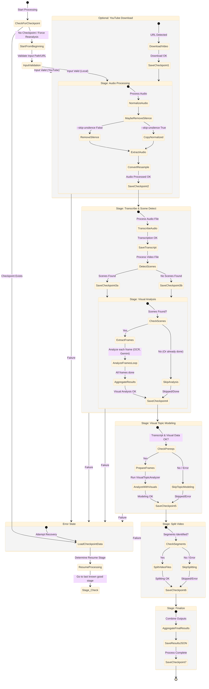

# Video Topic Splitter: It Chops Videos. Intelligently. Sometimes

[SIFT analsys](SIFT-assesment.md)

This software exists. Its purpose is to accept a video file, specifically one involving screen activity like troubleshooting or tutorials, and divide it into smaller segments. These divisions are not arbitrary; they correspond to shifts in the topic, as determined by an analysis of both the spoken words (transcription) and the pixels displayed (visual analysis). The ultimate, perhaps optimistic, goal is to make the content of such videos searchable, potentially saving users from re-watching hours of footage to find a specific five-minute solution. A simple transaction: computation and API keys are provided, segmented video and analysis artifacts are returned.

## What It Does (Features, Allegedly)

* **Audio Processing:** Extracts audio, normalizes volume levels so nothing is offensively loud or suspiciously quiet, and optionally removes periods of silence. Silence, while golden, is computationally inefficient for transcription.
* **Transcription:** Sends the processed audio to an external service (currently Deepgram) which converts the spoken word into text, complete with timestamps. Accuracy is contingent upon speech clarity and API benevolence.
* **Scene Detection:** Examines video frames, looking for significant visual shifts, thereby partitioning the video into distinct scenes based purely on pixel-level differences.
* **Visual Analysis:** For each scene, extracts representative frames. These frames are subjected to scrutiny by another AI (Google's Gemini) which describes what it sees, focusing on UI elements, text, and activity. It also performs Optical Character Recognition (OCR) to identify predefined software names appearing on screen.
* **Multimodal Topic Modeling:** The core computational step. Feeds transcript segments, along with corresponding visual analysis of frames, to yet another AI (configured via OpenRouter, e.g., `microsoft/phi-4`). This AI determines the primary topic for each segment and identifies shifts (or lack thereof) between segments, considering both text and visuals.
* **Video Segmentation:** Based on the topic shifts identified by the multimodal analysis, the original video is physically cut into separate, smaller video files. One file per identified topic segment.
* **Checkpointing:** Diligently saves progress after major operational stages. Should the process be interrupted (by user action, system crash, or cosmic indifference), it can often resume from the last saved checkpoint, sparing redundant computation.
* **Output:** Generates a structured project directory containing intermediate files (audio, frames, raw analyses) and the final outputs: the split video segments and JSON files detailing the transcript, scene information, and the combined visual-topic analysis results.

## Pipeline Visual


```mermaid
---
config:
  theme: base
---
stateDiagram-v2
    [*] --> CheckForCheckpoint: Start Processing
    CheckForCheckpoint --> LoadCheckpointData: Checkpoint Exists
    CheckForCheckpoint --> StartFromBeginning: No Checkpoint / Force Reanalysis
    LoadCheckpointData --> ResumeProcessing: Determine Resume Stage
    StartFromBeginning --> InputValidation: Validate Input Path/URL
    ResumeProcessing --> Stage_Check: Go to last known good stage
    InputValidation --> Stage_YoutubeDL: Input Valid (YouTube)
    InputValidation --> Stage_AudioProcessing: Input Valid (Local)
    state "Optional: YouTube Download" as Stage_YoutubeDL {
        direction TB
        [*] --> DownloadVideo: URL Detected
        DownloadVideo --> SaveCheckpoint1: Download OK
        SaveCheckpoint1 --> Stage_AudioProcessing
    }
    state "Stage: Audio Processing" as Stage_AudioProcessing {
        direction TB
        [*] --> NormalizeAudio: Process Audio
        NormalizeAudio --> MaybeRemoveSilence
        MaybeRemoveSilence --> RemoveSilence: --skip-unsilence False
        MaybeRemoveSilence --> CopyNormalized: --skip-unsilence True
        RemoveSilence --> ExtractAudio
        CopyNormalized --> ExtractAudio
        ExtractAudio --> ConvertResample
        ConvertResample --> SaveCheckpoint2: Audio Processed OK
    }
    SaveCheckpoint2 --> Stage_TranscribeDetect
    state "Stage: Transcribe & Scene Detect" as Stage_TranscribeDetect {
        direction TB
        [*] --> TranscribeAudio: Process Audio File
        TranscribeAudio --> SaveTranscript: Transcription OK
        SaveTranscript --> DetectScenes: Process Video File
        DetectScenes --> SaveCheckpoint3a: Scenes Found
        DetectScenes --> SaveCheckpoint3b: No Scenes Found
        SaveCheckpoint3a --> Stage_VisualAnalysis
        SaveCheckpoint3b --> Stage_VisualAnalysis # Still proceed to analysis, but it might be skipped internally
    }
    state "Stage: Visual Analysis" as Stage_VisualAnalysis {
        direction TB
        [*] --> CheckScenes: Scenes Found?
        CheckScenes --> ExtractFrames: Yes
        CheckScenes --> SkipAnalysis: No (Or already done)
        ExtractFrames --> AnalyzeFramesLoop: Analyze each frame (OCR, Gemini)
        AnalyzeFramesLoop --> AggregateResults: All frames done
        AggregateResults --> SaveCheckpoint4: Visual Analysis OK
        SkipAnalysis --> SaveCheckpoint4: Skipped/Done
    }
    SaveCheckpoint4 --> Stage_VisualTopicModeling
    state "Stage: Visual Topic Modeling" as Stage_VisualTopicModeling {
        direction TB
        [*] --> CheckPrereqs: Transcript & Visual Data OK?
        CheckPrereqs --> PrepareFrames: Yes
        CheckPrereqs --> SkipTopicModeling: No / Error
        PrepareFrames --> AnalyzeWithVisuals: Run VisualTopicAnalyzer
        AnalyzeWithVisuals --> SaveCheckpoint5: Modeling OK
        SkipTopicModeling --> SaveCheckpoint5: Skipped/Error
    }
    SaveCheckpoint5 --> Stage_SplitVideo
    state "Stage: Split Video" as Stage_SplitVideo {
        direction TB
        [*] --> CheckSegments: Segments Identified?
        CheckSegments --> SplitVideoFiles: Yes
        CheckSegments --> SkipSplitting: No / Error
        SplitVideoFiles --> SaveCheckpoint6: Splitting OK
        SkipSplitting --> SaveCheckpoint6: Skipped/Error
    }
    SaveCheckpoint6 --> Stage_Finalize
    state "Stage: Finalize" as Stage_Finalize {
        direction TB
        [*] --> AggregateFinalResults: Combine Outputs
        AggregateFinalResults --> SaveResultsJSON
        SaveResultsJSON --> SaveCheckpoint7: Process Complete
    }
    SaveCheckpoint7 --> [*]
    state "Error State" as Error {
      [*] --> LoadCheckpointData: Attempt Recovery
    }
    Stage_AudioProcessing --> Error: Failure
    Stage_TranscribeDetect --> Error: Failure
    Stage_VisualAnalysis --> Error: Failure
    Stage_VisualTopicModeling --> Error: Failure
    Stage_SplitVideo --> Error: Failure
```

## What It Uses (The Tech Stack Assemblage)

* **Core Logic:** Python 3.8+
* **Transcription:** Deepgram API (Nova-2 model used internally)
* **Visual Analysis:** Google Gemini API (currently `gemini-1.5-pro-latest`)
* **Topic Modeling & Analysis:** LLM via OpenRouter API (e.g., `microsoft/phi-4`)
* **Audio Handling:** `ffmpeg`, `ffmpeg-normalize`
* **Video Processing:** `opencv-python`, `PySceneDetect`
* **OCR:** `pytesseract`
* **API Interaction:** `openai` (for OpenRouter), `deepgram` Python clients
* **Concurrency:** `asyncio` (used within topic analysis)
* **Packaging:** `setuptools`
* **Environment:** Runs locally or within Docker (see below).

## Installation

Requires Python 3.8 or higher and `ffmpeg`. Installation proceeds via this command, executed with appropriate permissions in the root directory containing `setup.py`:

```bash
pip install .
```

Alternatively, the provided Docker setup can be used.

## Configuration (API Keys: The Necessary Evil)

This software communicates with external AI services requiring authentication via API keys. These services are typically not free. Keys must be obtained from the respective providers:

* Deepgram
* Google AI (for Gemini)
* OpenRouter

Place these keys into a `.env` file in the project's root directory, formatted as follows:

```bash
# .env file contents
DG_API_KEY=the_deepgram_key
GEMINI_API_KEY=the_google_gemini_key
OPENROUTER_API_KEY=the_openrouter_key
```

Failure to provide valid keys results in operational failure, likely accompanied by error messages. The software bears no responsibility for key procurement or management.

## Usage (Making It Do The Thing)

Execution occurs via the terminal interface: `video-topic-splitter`.

**Basic Example:**

```bash
video-topic-splitter -i "/path/to/a/screencast.mp4" -o "/path/to/output/directory" --register "tech-support"
```

**Arguments:**

* `-i`, `--input`: **Required.** Path to the video file (e.g., `.mp4`, `.mkv`) or a YouTube URL.
* `-o`, `--output`: **Required.** Directory where the project folder containing all outputs will be created.
* `--api`: Transcription API. Currently only `deepgram` is implemented.
* `--scene-threshold`: Sensitivity for detecting visual scene cuts. Default: `27.0`.
* `--min-scene-len`: Minimum duration in seconds for a detected scene. Default: `1.0`.
* `--skip-unsilence`: If present, skips the audio silence removal step.
* `--software-list`: Path to a `.txt` file listing software names (one per line) for OCR detection. A default list is used if omitted.
* `--ocr-lang`: Language code for Tesseract OCR. Default: `eng`.
* `--frames-per-scene`: Number of frames to visually analyze per detected scene. Default: `3`.
* `--frame-format`: Format for extracted frames (`jpg` or `png`). Default: `jpg`.
* `--frame-quality`: Compression quality for JPG frames (1-100). Default: `90`.
* `--register`: Provides context to the analysis AI. Choices: `it-workflow`, `gen-ai`, `tech-support`, `educational`. Default: `it-workflow`.
* `--visual-similarity-threshold`: Threshold for visual analysis steps. Default: `0.6`.
* `--force-reanalysis`: If present, ignores existing checkpoints and re-runs all steps.
* `--extract-insights`: If present, attempts to generate and print a summary of key findings after processing.

## The Processing Pipeline (A Tedious Journey)

The software operates through a sequence of stages, managed by the `process_video` function in `core.py`:

1. **Initialization:** Creates a unique project folder. Checks for existing checkpoints.
2. **Input Handling:** Downloads video if input is a YouTube URL. Verifies local file existence otherwise.
3. **Audio Processing (`handle_audio_video`):** Normalizes audio, optionally removes silence, extracts audio stream, converts to mono, resamples. Checkpoint: `AUDIO_PROCESSED`.
4. **Transcription & Scene Detection (`handle_transcription_and_scene_detection`):** Transcribes audio. Detects visual scene boundaries. Checkpoints: `TRANSCRIPTION_COMPLETE`, `SCENES_DETECTED` (or `NO_SCENES_DETECTED`).
5. **Visual Analysis (`analyze_scenes`):** Extracts keyframes. Analyzes frames using Gemini (description) and Tesseract OCR (software names). Checkpoint: `VISUAL_ANALYSIS_COMPLETE`.
6. **Visual Frame Preparation (`prepare_visual_frames_for_topic_modeling`):** Organizes visual analysis results.
7. **Visual Topic Modeling (`process_transcript_with_visuals`):** Analyzes transcript utterances combined with visual frame data using `VisualTopicAnalyzer`. Determines topic shifts considering both modalities. Checkpoint: `VISUAL_TOPIC_MODELING_COMPLETE`.
8. **Video Splitting (`split_video_by_scenes`):** Cuts the processed video file into segments based on start/end times from the visual topic modeling results. Checkpoint: `VIDEO_SPLIT_COMPLETE`.
9. **Finalization:** Saves a final summary JSON. Checkpoint: `PROCESS_COMPLETE`.

## Project Output Structure

All outputs for a given input video reside within a dedicated project folder inside the specified output directory (e.g., `output_directory/video_name_timestamp/`). Key contents:

```shell
<project_name>_<timestamp>/
├── audio/                     # Intermediate audio files
│   ├── extracted_audio.opus
│   └── mono_resampled_audio.m4a
├── scenes/                    # Scene detection outputs (e.g., scenes.csv)
├── scene_frames/              # Extracted frame images (e.g., 1-1.jpg)
├── scene_analysis/            # Visual analysis results per scene
│   └── scene_analysis_results.json
├── split_videos/              # Final segmented video files
│   └── segment_1.mp4
│   └── segment_2.mp4
│   └── ...
├── transcription.json         # Raw API transcription response
├── transcript.json            # Simplified transcript (utterances)
├── visual_topic_analysis_results.json # Combined visual/text topic analysis
├── final_results.json         # Summary JSON linking all major outputs
└── checkpoint.pkl             # Stores processing state for resuming
```

## Dockerized Deployment

For containerization enthusiasts.

1. **Create `.env` file:** As described in Configuration.
2. **Create Host Directories:** `mkdir -p data/app data/workspace`
3. **Build & Run:** `docker-compose up --build`
4. **Execute:**
      * Place input video in `./data/app/` on the host machine.
      * Get a shell inside the container: `docker exec -it video-processor bash`
      * Run the tool using paths inside the container:

        ```bash
        video-topic-splitter -i /app/data/input.mp4 -o /home/vts/data/workspace/output_project --register tech-support
        ```

      * Outputs appear in `./data/workspace/output_project` on the host.

*(Refer to `docker-compose.yml` and `Dockerfile` for specifics of the container environment.)*

## Contributing

Originating as an exploration involving Large Language Models in development, contributions are theoretically welcome if aligned with the project's specific goals. Standard fork/pull-request workflow is presumed applicable.

## License

[MIT License](https://www.google.com/search?q=LICENSE) - Permits broad usage within reasonable legal bounds. Attribution is noted as appreciated but not aggressively mandated.
