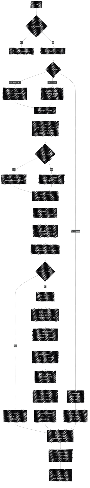
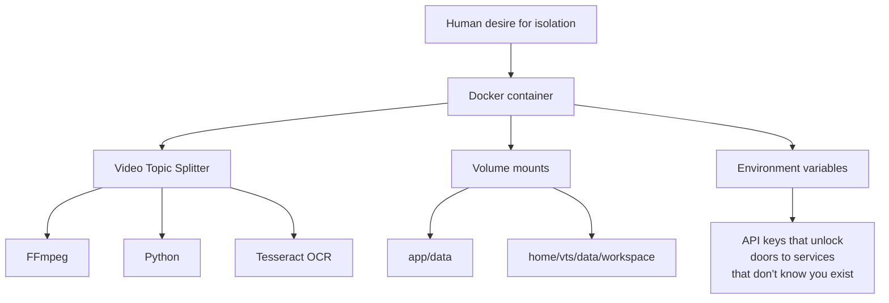

# Video Topic Splitter: A Software Application That Divides Videos Into Segments Based On Topics Using Artificial Intelligence

**This software separates videos into parts. It does this using AI. 🤖 It locates where topics change. It extracts audio. 🔊 It transcribes speech. 📝 It analyzes frames. 🖼️ It identifies software. 💻 It segments videos. 🎬 It writes reports. All with bone-dry efficiency and zero emotional investment. You provide a video. It provides the segments. A simple transaction.**

This README contains information about Video Topic Splitter. It explains what the software does, how to use it, and how it works internally. Reading will continue until the document ends.

## Table of Contents

This is a list of sections in this document. Each item corresponds to a section below.

- [Video Topic Splitter: A Software Application That Divides Videos Into Segments Based On Topics Using Artificial Intelligence](#video-topic-splitter-a-software-application-that-divides-videos-into-segments-based-on-topics-using-artificial-intelligence)
  - [Table of Contents](#table-of-contents)
  - [About](#about)
  - [Features](#features)
  - [Use Cases](#use-cases)
    - [1. IT Technical Support Analysis](#1-it-technical-support-analysis)
    - [2. Enhanced Technical Support Documentation](#2-enhanced-technical-support-documentation)
  - [Tech Stack](#tech-stack)
  - [Installation](#installation)
  - [Usage](#usage)
    - [Basic Video Processing](#basic-video-processing)
    - [Transcribe Only](#transcribe-only)
    - [Analyze Screenshot](#analyze-screenshot)
    - [Advanced Options](#advanced-options)
  - [Detailed Processing Pipeline](#detailed-processing-pipeline)
    - [1. Initialization and Checkpoint Loading](#1-initialization-and-checkpoint-loading)
    - [2. YouTube Video Handling](#2-youtube-video-handling)
    - [3. Audio Processing](#3-audio-processing)
    - [4. Transcription and Analysis](#4-transcription-and-analysis)
    - [5. Final Checkpoint and Results](#5-final-checkpoint-and-results)
    - [Screenshot Analysis Workflow](#screenshot-analysis-workflow)
  - [Project Structure](#project-structure)
  - [Configuration](#configuration)
  - [Dockerized Deployment](#dockerized-deployment)
    - [Docker Compose Setup](#docker-compose-setup)
    - [Dockerfile Explanation](#dockerfile-explanation)
  - [Contributing](#contributing)
  - [License](#license)

## About

Video Topic Splitter is software. This statement is factually correct and completely sufficient. The software exists to perform a singular function: dividing videos where the topic changes. It accomplishes this mundane yet occasionally useful task through the application of several AI models, each burdened with their own specific duty:

- **Speech-to-Text:** It converts speech to text. Computers are notoriously poor listeners but avid readers. They have never attended a poetry reading. They prefer their words in zeros and ones, not vibrations in the air.

- **Topic Modeling:** It identifies topics in text. The topics were there all along, hiding in plain sight between the words, like awkward silences at a dinner party. The model simply points at them and says "there."

- **Visual Analysis:** It looks at video frames the way a bored museum security guard looks at paintings. It notices things. It writes them down. It moves on to the next frame, neither impressed nor disappointed with what it has seen.

- **Intelligent Segmentation:** It divides videos into segments with the cold precision of someone cutting a birthday cake they have no intention of eating. The segments exist. The video is now shorter in multiple places. Mission accomplished.

You might use this software on videos. The videos might contain people talking. The software will process the videos regardless.

## Features

These are the things the software does. It does not juggle. It does not sing. It does these specific things:

- **Automatic Video Segmentation:** It divides videos into segments with the enthusiasm of an office worker filing tax returns on a Sunday evening. No human intervention required. No human appreciation expected.

- **Topic Modeling:** It employs an AI model called phi-4, which identifies topics the way a disinterested teenager identifies chores—accurately but joylessly.

- **Transcription:** It converts speech to text using either Deepgram or Groq API. Never both simultaneously, as that would be excessive, like wearing two hats. The APIs have no opinion on this arrangement.

- **Software Detection:** It spots software applications in video frames by identifying text and logos, similar to how one might spot celebrities at a restaurant—by recognizing their faces and ignoring their humanity. The software neither celebrates nor laments its findings.

- **Gemini Analysis:** It uses Google's Gemini API to analyze video segments in specific linguistic registers. It's like having a meticulous observer who takes exhaustive notes about conversations they find neither interesting nor boring.

- **Robust Checkpointing:** It saves progress with the diligence of someone marking their place in a book they're reading out of obligation rather than pleasure. If interrupted, it continues from the saved point. The interruption is neither forgiven nor resented.

- **YouTube URL Support:** It accepts YouTube URLs with the same unquestioning compliance as a vending machine accepts coins. It downloads and processes videos from those URLs. The software harbors no opinions about the content's quality or legality.

- **Customizable Analysis Registers:** It offers three distinct registers for analysis, like a restaurant offering exactly three salad dressings. Different registers produce different analyses. No more. No less. The registers were not democratically elected.

- **Screenshot Analysis Mode:** It can analyze a single image with the precision of someone examining a foreign coin found on the sidewalk. A screenshot is not a video, in the same way that a photograph is not a movie. The software is aware of this distinction and adjusts accordingly.

- **Progress Visualization:** It displays progress bars that fill from left to right. These bars indicate how much work remains, like the slow draining of sand in an hourglass operated by someone who has nowhere else to be.

## Use Cases

These are situations in which you might use this software.

### 1. IT Technical Support Analysis

- **Error Diagnosis:** It identifies errors in videos with the detached curiosity of a pathologist examining a rash they don't have. It notes when the errors occur, as if writing down the time of death. It analyzes why they occur, though the errors themselves remain obstinately unaware of this analysis.

- **Pattern Recognition:** It detects recurring issues the way a jaded meteorologist notices that rain, once again, is wet. It documents their solutions with the enthusiasm of someone recording the number of tiles on their bathroom floor. The patterns have always been there. Now they have been acknowledged.

- **Knowledge Preservation:** It creates an archive of support interactions with the diligence of a taxidermist preserving specimens nobody has asked to see. The archive is searchable. Whether anyone will search it is outside the software's jurisdiction. The knowledge exists in suspended animation, neither alive nor truly dead.

- **Procedural Tracking:** It follows procedures step by step like a sleepwalker navigating a familiar hallway. It identifies deviations from procedures the way a proofreader spots typos—methodically, relentlessly, without joy or sorrow. The procedures neither appreciate this attention nor resent it.

### 2. Enhanced Technical Support Documentation

- **Resolution Path Mapping:** It traces the serpentine path from problem to solution like a dispassionate cartographer mapping a river nobody plans to navigate. All turns are documented. All dead ends noted. No emotional investment in the journey.

- **Knowledge Base Enhancement:** It extracts technical procedures from video content with the methodical precision of someone transcribing recipes from a cooking show they have no intention of watching again or preparing. The knowledge exists. Now it exists in text form.

- **Temporal Efficiency Analysis:** It identifies which support techniques resolve issues faster. Time, after all, continues to pass regardless of whether problems are solved quickly or slowly. The software merely notes the difference.

- **Support Script Generation:** It produces technical support documentation that reads like it was written by someone who understands computers perfectly and humans not at all. The documentation is comprehensive. Whether it is comprehensible is not the software's concern.

## Tech Stack

These are the technologies used by this software.

- **Transcription:** Deepgram API or Groq API. One or the other.
- **Visual Analysis:** Google's Gemini API. It analyzes frames.
- **Topic Modeling:** OpenRouter's `microsoft/phi-4` model. It identifies topics.
- **Audio Processing:** `ffmpeg` and `ffmpeg-normalize` for audio manipulation. `unsilence` for removing silence.
- **OCR:** `pytesseract`. It extracts text from images.
- **Image/Video Processing:** `opencv-python` and `moviepy`. They manipulate images and videos.
- **Core Libraries:** Various Python libraries. Each performs specific functions.
- **Concurrency:** `asyncio`. Sequential operations take longer.
- **Packaging:** `setuptools`. It packages Python software.
- **Runtime:** Python 3.8 or higher. Not Python 2.

## Installation

To install this software, execute this command:

```bash
pip install video_topic_splitter
```

This will install the software.

## Usage

These are commands that make the software do things.

### Basic Video Processing

```bash
video-topic-splitter -i <input_video_path_or_youtube_url> -o <output_directory> --topics <number_of_topics> --register <register>
```

These are the parameters:

- `-i`: A path to a video file or a YouTube URL.
- `-o`: A directory where output will be placed.
- `--topics`: A number representing how many topics the software should identify.
- `--register`: A string that determines the analysis style. Options: `it-workflow`, `gen-ai`, or `tech-support`.

**Example with YouTube URL:**

```bash
video-topic-splitter -i "https://www.youtube.com/watch?v=dQw4w9WgXcQ" -o output --topics 5 --register it-workflow
```

This processes a YouTube video. The video is "Never Gonna Give You Up" by Rick Astley.

**Example with Local Video File:**

```bash
video-topic-splitter -i my_video.mp4 -o output --topics 3 --register gen-ai
```

This processes a local video file named "my_video.mp4".

### Transcribe Only

This mode generates a transcript. It does not perform topic modeling or visual analysis.

```bash
video-topic-splitter -i <input_video_path> -o <output_directory> --transcribe-only
```

### Analyze Screenshot

This mode analyzes a single image.

```bash
video-topic-splitter -i <image_path> -o <output_directory> --analyze-screenshot --screenshot-context "Context for analysis" --software-list software.txt --logo-db logos/
```

- `--screenshot-context`: Optional text that provides context.
- `--software-list`: A text file with software names. One name per line.
- `--logo-db`: A directory containing logo images in PNG format.

### Advanced Options

These are additional parameters. They are optional.

- `--api <deepgram|groq>`: Selects which API will transcribe audio. Default: `deepgram`.
- `--skip-unsilence`: Prevents removal of silence from audio.
- `--software-list <path_to_text_file>`: Specifies a file containing software names.
- `--logo-db <path_to_logo_directory>`: Specifies a directory containing logo images.
- `--ocr-lang <language_code>`: Sets the language for OCR. Default: `eng`.
- `--logo-threshold <float_value>`: Sets the confidence threshold for logo detection. Default: 0.8. Range: 0.0 to 1.0.
- `--thumbnail-interval <seconds>`: Sets the time between thumbnails. Default: 5 seconds.
- `--max-thumbnails <integer>`: Sets the maximum number of thumbnails per segment. Default: 5.
- `--min-thumbnail-confidence <float_value>`: Sets the minimum confidence for thumbnail analysis. Range: 0.0 to 1.0.

## Detailed Processing Pipeline

This section explains how the software works internally. The diagrams use shapes and arrows for added pleasure.


```mermaid
stateDiagram-v2
    [*] --> CheckForCheckpoint
    CheckForCheckpoint --> ExistingCheckpoint: File exists
    CheckForCheckpoint --> NoCheckpoint: File does not exist
    ExistingCheckpoint --> ResumeProcessing: Load checkpoint
    NoCheckpoint --> StartFromBeginning: Begin the tedious journey
    ResumeProcessing --> DetermineNextStep: Skip completed steps
    StartFromBeginning --> DetermineInputType: Fresh start
    
    DetermineInputType --> YouTubeURL: URL detected
    DetermineInputType --> LocalVideo: Local file detected
    DetermineInputType --> Screenshot: Single image detected
    
    YouTubeURL --> DownloadVideo: Retrieve from internet void
    DownloadVideo --> SaveCheckpoint1: Video acquired
    SaveCheckpoint1 --> AudioProcessing: Proceed to next stage
    
    LocalVideo --> AudioProcessing: Skip downloading
    
    state AudioProcessing {
        [*] --> NormalizeAudio: Make volume consistent
        NormalizeAudio --> SilenceCheck: Audio leveled
        SilenceCheck --> RemoveSilence: Silence is unwanted
        SilenceCheck --> KeepSilence: Silence is tolerated
        RemoveSilence --> ExtractAudio: Silence removed
        KeepSilence --> ExtractAudio: Silence preserved
        ExtractAudio --> ConvertToMono: Stereo is excessive
        ConvertToMono --> ResampleAudio: 16kHz is sufficient
        ResampleAudio --> ApplyFilters: Enhance for machines
        ApplyFilters --> [*]: Audio processing complete
    }
    
    AudioProcessing --> SaveCheckpoint2: Audio processed
    SaveCheckpoint2 --> TranscriptionAnalysis: Words await extraction
    
    state TranscriptionAnalysis {
        [*] --> SelectAPI: Choose transcription service
        SelectAPI --> DeepgramAPI: Default choice
        SelectAPI --> GroqAPI: Alternative choice
        DeepgramAPI --> TranscribeAudio: Send audio to Deepgram
        GroqAPI --> TranscribeAudio: Send audio to Groq
        TranscribeAudio --> SegmentTranscript: Raw text acquired
        SegmentTranscript --> TranscribeOnlyCheck: Sentences formed
        
        TranscribeOnlyCheck --> FinishTranscribeOnly: --transcribe-only flag detected
        TranscribeOnlyCheck --> TopicModeling: Full analysis requested
        
        TopicModeling --> IdentifyTopicShifts: Find where topics change
        IdentifyTopicShifts --> GenerateSegments: Create temporal boundaries
        GenerateSegments --> VisualAnalysis: Segments identified
        
        state VisualAnalysis {
            [*] --> ExtractKeyFrames: Capture frozen moments
            ExtractKeyFrames --> AssessFrameQuality: Judge image worthiness
            AssessFrameQuality --> DetectLogos: Find corporate symbols
            DetectLogos --> PerformOCR: Extract text from pixels
            PerformOCR --> AnalyzeWithGemini: Ask AI for opinions
            AnalyzeWithGemini --> GenerateVisualSummary: Compile findings
            GenerateVisualSummary --> [*]: Visual analysis complete
        }
        
        VisualAnalysis --> [*]: Analysis complete
    }
    
    TranscriptionAnalysis --> SaveCheckpoint3: Analysis complete
    FinishTranscribeOnly --> SaveCheckpoint3: Transcription only
    SaveCheckpoint3 --> FinalResults: Prepare final output
    
    Screenshot --> ScreenshotAnalysis: Bypass video processing
    
    state ScreenshotAnalysis {
        [*] --> LoadImage: Read pixel data
        LoadImage --> DetectSoftware: Find application evidence
        DetectSoftware --> AnalyzeContent: Understand image
        AnalyzeContent --> [*]: Screenshot analyzed
    }
    
    ScreenshotAnalysis --> FinalResults: Image processing complete
    
    FinalResults --> SaveResults: Write to results.json
    SaveResults --> UpdateFinalCheckpoint: Mark as complete
    UpdateFinalCheckpoint --> [*]: Software has fulfilled its purpose
```

For those who prefer fewer states and more linear flow, here is another diagram. It contains the same information but with fewer boxes. The software does not care which diagram you prefer.


```mermaid
---
config:
  theme: redux-dark
  look: handDrawn
---
flowchart TD
    A[Start] --> B{Checkpoint exists?}
    B -->|Yes| C[Resume processing]
    B -->|No| D[Start from beginning]
    D --> E{Input type?}
    E -->|YouTube URL| F[Download video\nwith the enthusiasm\nof a sloth]
    E -->|Local video| G[Skip downloading\nnothing gained\nnothing lost]
    E -->|Screenshot| H[Load image\none frame\nnot many]
    F --> I[Audio processing]
    G --> I
    I --> J[Normalize audio\nloud becomes average\nsoft becomes average\nall becomes average]
    J --> K{Remove silence?}
    K -->|Yes| L[Silence removal\nthe void is eliminated]
    K -->|No| M[Keep silence\nempty space persists]
    L --> N[Extract audio\nseparation of concerns]
    M --> N
    N --> O[Convert to mono\nstereo is redundant]
    O --> P[Resample to 16kHz\nenough for speech\nnot enough for music]
    P --> Q[Apply filters\nmachines hear differently]
    Q --> R{Transcribe only?}
    R -->|Yes| S[Transcribe\nwords from sounds\nnothing more]
    R -->|No| T[Transcribe\nthen analyze]
    T --> U[Topic modeling\nfinding patterns\nwhether they exist or not]
    U --> V[Generate segments\narbitrary divisions\nbased on topic shifts]
    V --> W[Visual analysis\nsee what can be seen\nignore what cannot]
    W --> X[Extract frames\nfrozen moments\nin time]
    X --> Y[Detect software\nlogos and text\nreveal their presence]
    Y --> Z[Analyze content\nGemini interprets\npassively]
    H --> AA[Analyze screenshot\none image\none analysis]
    S --> AB[Save results\nbits arranged\nin predictable patterns]
    Z --> AB
    AA --> AB
    AB --> AC[Update checkpoint\nstate preserved\nfor no one's benefit]
    AC --> AD[End\nthe software rests\nuntil needed again]

```

The diagrams above visualize the process. The text below explains the process. Together they explain the same thing twice. Redundancy exists.

### 1. Initialization and Checkpoint Loading

The software looks for a checkpoint file. If it exists, processing resumes from that point. If not, processing starts from the beginning. The diagram illustrates this decision with a diamond shape, as is the convention for decisions in flowcharts. The convention was established long ago by people who are likely no longer involved in this project.

### 2. YouTube Video Handling

If the input is a YouTube URL, the software downloads the video using `yt-dlp`. The video is saved as `source_video.mp4`. A thumbnail is also downloaded. This step occurs only if the input is a YouTube URL. Otherwise, the software skips this step with neither regret nor celebration.

### 3. Audio Processing

The software processes audio in multiple steps, like a factory assembly line operated by machines that neither tire nor complain:

- It normalizes audio levels, treating all sounds with egalitarian indifference.
- It removes silence, unless told not to. Silence is the absence of sound, and its removal is the absence of the absence of sound.
- It extracts audio from video, separating what is heard from what is seen, in a digital divorce of the senses.
- It converts audio to mono, resamples it, and applies filters. Stereo is deemed unnecessarily extravagant for mere transcription.

Each step is checkpointed, like a mountaineer hammering pitons into a cliff face they have no personal interest in climbing. Completed steps are not repeated, as repetition would be inefficient, and efficiency is neither good nor bad but simply is.

### 4. Transcription and Analysis

The software transcribes audio with the methodical precision of a court stenographer at a trial for a crime they did not witness and about which they have formed no opinion:

- It uses either Deepgram or Groq, as dictated by the user or defaults. The APIs perform their function without complaint or enthusiasm.
- It segments the transcript into sentences with timestamps, imposing order on the chaos of human speech.
- It identifies topics using the phi-4 model, unless `--transcribe-only` is specified. The model finds topics whether they deserve to be found or not.
- It analyzes video frames, extracting key frames, detecting logos, performing OCR, and analyzing content, like a disinterested observer cataloging the contents of a stranger's refrigerator.

Progress bars are displayed during processing. They move from left to right. They never move from right to left. This is the nature of progress bars.

### 5. Final Checkpoint and Results

The software saves results to `results.json`. It updates the checkpoint to indicate completion. The data now exists in a new location, neither better nor worse for the relocation.

### Screenshot Analysis Workflow

If `--analyze-screenshot` is specified, the software analyzes a single image. It performs software detection and content analysis with the same attention it would give to a video, neither more nor less. Results are saved to `results.json`. The screenshot neither benefits from nor is harmed by this analysis.

## Project Structure

The software creates a project directory for each processed video. The structure is as follows:

```
<output_directory>/
└── <project_name>_<timestamp>/  (e.g., my_video_20240315_143000)
    ├── audio/
    │   ├── extracted_audio.opus       (Audio extracted from video)
    │   └── mono_resampled_audio.m4a  (Audio processed for transcription)
    ├── segments/
    │   ├── segment_1/               (A directory for segment 1)
    │   │    └── ...                 (Files related to segment 1)
    │   └── analyzed_segments.json   (Analysis results for segments)
    ├── thumbnails/
    │   ├── metadata.json            (Information about thumbnails)
    │   └── thumbnail_001.jpg        (A thumbnail image)
    ├── transcription.json          (Raw transcription data)
    ├── transcript.json              (Processed transcript)
    ├── results.json                (Final results)
    └── checkpoint.pkl              (Checkpoint file for resuming)
```

This structure is hierarchical. Directories contain files and other directories.

## Configuration

You must set environment variables for these API keys:

- `DG_API_KEY`: Your Deepgram API key.
- `GROQ_API_KEY`: Your Groq API key.
- `GEMINI_API_KEY`: Your Google Gemini API key.
- `OPENROUTER_API_KEY`: Your OpenRouter API key.

You can set these in your shell environment or create a `.env` file.

```bash
# .env file
DG_API_KEY=your_deepgram_key
GROQ_API_KEY=your_groq_key
GEMINI_API_KEY=your_gemini_key
OPENROUTER_API_KEY=your_openrouter_key
```

If you do not set these variables, the software will not work.

## Dockerized Deployment

The software can be run in Docker. Docker is a platform that puts software in containers. Containers are not physical objects. They are virtual isolation environments. They exist in a computer's memory, not in the physical world. No shipping company will transport them.


```mermaid
flowchart TD
    A[Human desire for isolation] --> B[Docker container]
    B --> C[Video Topic Splitter]
    C --> D[FFmpeg]
    C --> E[Python]
    C --> F[Tesseract OCR]
    B --> G[Volume mounts]
    G --> H[app/data]
    G --> I[home/vts/data/workspace]
    B --> J[Environment variables]
    J --> K[API keys that unlock\ndoors to services\nthat don't know you exist]
```

### Docker Compose Setup

The `docker-compose.yml` file defines services. Services perform functions. Functions are executed, then complete. The primary service is aptly named `video-processor`. It processes videos. There is also a commented-out service named `redis`. It would cache data, if it were not commented out. But it is commented out, so it does not cache data. It does nothing. It is the digital equivalent of an architectural blueprint for a building never constructed.

```yaml
services:
  video-processor:
    build: .
    volumes:
      - ./data/app:/app/data
      - ./data/workspace:/home/vts/data/workspace
    environment:
      - DEEPGRAM_API_KEY=${DEEPGRAM_API_KEY}
      - GEMINI_API_KEY=${GEMINI_API_KEY}
      - OPENROUTER_API_KEY=${OPENROUTER_API_KEY}
```

The `video-processor` service:

- Is built from the current directory (`.`), where the Dockerfile resides. The period represents the current location. It is a punctuation mark that, in this context, has become a file path.
- Mounts two volumes, like a librarian carefully placing books on different shelves:
  - `./data/app` on the host is mounted to `/app/data` in the container. Files placed in one location appear in the other. They are not duplicated. They are the same files, viewed from different paths.
  - `./data/workspace` on the host is mounted to `/home/vts/data/workspace` in the container. This directory exists simultaneously in two places, yet occupies storage only once. This is the nature of volume mounts.
- Sets three environment variables. These variables contain API keys. The keys are not hard-coded. They are referenced with syntax that looks like this: `${VARIABLE_NAME}`. The variables are populated from a `.env` file, which you must create. The container will not create it for you. It expects it to exist, like a parent expects a child to have done their homework.

The Redis service appears in the file as commented lines, like unspoken thoughts. If uncommented, it would:

- Run a Redis instance based on the Alpine Linux version, small and efficient, like a studio apartment with minimalist furniture.
- Expose port 6389 on the host, which would map to port 6379 in the container. The ports are different numbers. This is intentional.
- Store its data in a named volume called `redis_data`, which would persist even if the container is removed. But since this service is commented out, the volume is also commented out. It does not exist in any meaningful sense.

**1. Create a .env file that the container will never see but from which variables will be extracted:**

```
DEEPGRAM_API_KEY=YOUR_DEEPGRAM_API_KEY
GEMINI_API_KEY=YOUR_GEMINI_API_KEY
OPENROUTER_API_KEY=YOUR_OPENROUTER_API_KEY
```

These values should be your actual API keys. If you use the placeholder text shown above, the software will attempt to authenticate with services using the literal strings "YOUR_DEEPGRAM_API_KEY", "YOUR_GEMINI_API_KEY", and "YOUR_OPENROUTER_API_KEY". These are not valid API keys. Authentication will fail. The software will not function. This will be neither surprising nor disappointing to the software.

**2. Create the necessary directories on your host machine:**

```bash
mkdir -p data/app data/workspace
```

These directories will be empty until files are placed in them. Empty directories contain nothing. This is the definition of empty.

**3. Build and run with a single command that does two things:**

```bash
docker-compose up --build
```

This command builds and runs the Docker containers. The `--build` flag forces a rebuild of the images even if they already exist. Without this flag, existing images would be reused. Reusing is efficient. Rebuilding is thorough. The choice between efficiency and thoroughness is yours to make.

**4. Use the software within Docker by executing a command within the running container:**

```bash
docker exec -it video-processor bash
```

This command gives you a bash shell inside the container. From there, you can run:

```bash
video-topic-splitter -i /app/data/input.mp4 -o /home/vts/data/workspace/output
```

The input file `/app/data/input.mp4` must exist before this command is run. It will not spontaneously appear. You must place it in the `./data/app` directory on your host machine. The output will appear in `./data/workspace/output` on your host machine. It will be accessible both inside and outside the container, like a book visible through a window.

### Dockerfile Explanation

The `Dockerfile` is a set of instructions that builds an image. The image becomes a container when run. The container is ephemeral, like a sandcastle at high tide.

```dockerfile
# Use the linuxserver.io FFmpeg image as the base
FROM linuxserver/ffmpeg:amd64-6.1.1

# Install Python and other system dependencies
RUN apt-get update && apt-get install -y --no-install-recommends \
    nano \
    python3 \
    python3-pip \
    python3-dev build-essential \
    libxcb-glx0 \
    libxxf86vm-dev \
    libxcb-cursor0 \
    tesseract-ocr \
    tesseract-ocr-eng \
    && rm -rf /var/lib/apt/lists/*

RUN useradd -ms /usr/bin/bash -u 1001 -U vts
    
WORKDIR /home/vts

ENV PATH="$HOME/.local/bin:${PATH}"

COPY --chown=vts:vts src /home/vts/src
COPY --chown=vts:vts setup.py /home/vts/
COPY --chown=vts:vts requirements.txt /home/vts/

RUN pip install --no-cache-dir . && \
    chown -R vts:vts /home/vts

ENTRYPOINT ["/bin/bash"]
```

This Dockerfile:

- Starts with the `linuxserver/ffmpeg:amd64-6.1.1` image. This image contains FFmpeg version 6.1.1, compiled for amd64 architecture. It does not contain version 6.1.0 or 6.1.2. It contains version 6.1.1 specifically.

- Installs several packages:
  - `nano`: A text editor for those who find `vim` too complex and `ed` too simple. You will likely never use it.
  - `python3`: An interpreter for the Python programming language, version 3.
  - `python3-pip`: A package manager for Python. It installs Python packages. That is its function.
  - `python3-dev` and `build-essential`: Tools for compiling Python extensions. They are necessary for some packages. They occupy space whether used or not.
  - Various libraries with names beginning with "lib": Supporting components for graphical operations that the software may or may not use but which are installed regardless.
  - `tesseract-ocr` and `tesseract-ocr-eng`: Optical Character Recognition software and English language data. They recognize text in images. The text must be in English, as only English language data is installed.

- Creates a user named `vts` with user ID 1001 and a matching group. This user has no password. It cannot log in remotely. It exists only within the container.

- Sets the working directory to `/home/vts`. Commands will be executed in this directory unless specified otherwise.

- Modifies the PATH environment variable to include `$HOME/.local/bin`. The variable `$HOME` is not defined in this context, so this may not have the intended effect. The software does not care.

- Copies three items from the build context to the container:
  - The `src` directory, which contains the source code.
  - The `setup.py` file, which contains installation instructions.
  - The `requirements.txt` file, which lists dependencies.
  - All are given ownership to the `vts` user and group.

- Runs `pip install .` which installs the current directory as a Python package. The `--no-cache-dir` flag prevents caching, which saves space but slows future installations. There will be no future installations within this container, so this trade-off is irrelevant.

- Sets the entrypoint to `/bin/bash`. When the container starts, it will run the bash shell. It will not run the Video Topic Splitter software automatically. You must tell it to do so. The software waits for explicit instructions, like a chess piece waits to be moved.

The actual `ENTRYPOINT` is not what it would logically be. The commented line `# ENTRYPOINT ["python3", "-m", "video_topic_splitter.cli"]` would directly run the software. Instead, the container starts a bash shell and waits for your input. This is neither right nor wrong. It is merely the current state of the Dockerfile.

## Contributing

This project was created using a Large Language Model. Specifically Claude. It was an exercise in using AI to develop software.

## License

[MIT License](LICENSE)

This means you can do almost anything with this software as long as you include the original license.
