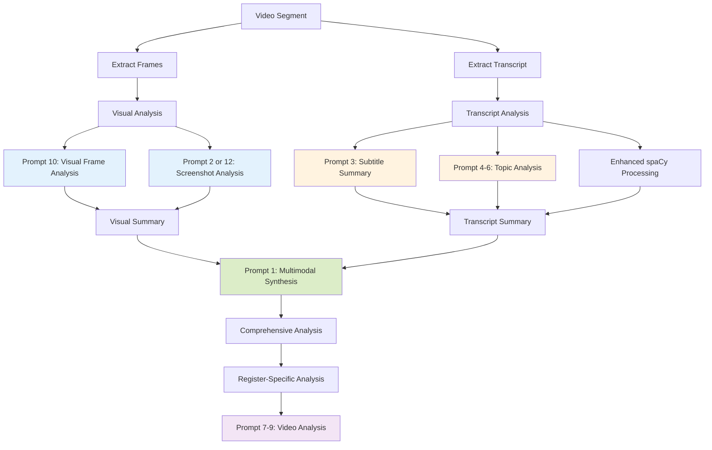

# Analysis Prompts Reference - Complete Documentation

**Project**: video_topic_splitter
**Document Version**: 1.0
**Date**: 2025-11-01
**Total Prompts**: 12

---

## Table of Contents

- [Part I: Executive Summary](#part-i-executive-summary)
- [Part II: Analysis Workflow Overview](#part-ii-analysis-workflow-overview)
- [Part III: SFL Framework Prompts (Category A)](#part-iii-sfl-framework-prompts-category-a)
  - [Prompt 1: Multimodal Technical Analysis](#prompt-1-multimodal-technical-analysis-prompt)
  - [Prompt 2: Technical Screenshot Analysis](#prompt-2-technical-screenshot-analysis-prompt)
  - [Prompt 3: Subtitle Summary](#prompt-3-subtitle-summary-prompt)
- [Part IV: Register-Specific Prompts (Category B)](#part-iv-register-specific-prompts-category-b)
  - [Topic Analysis Prompts](#topic-analysis-prompts)
    - [Prompt 4: IT Workflow Topic](#prompt-4-it-workflow-topic-prompt)
    - [Prompt 5: Generative AI Topic](#prompt-5-generative-ai-topic-prompt)
    - [Prompt 6: Technical Support Topic](#prompt-6-technical-support-topic-prompt)
  - [Video Analysis Prompts](#video-analysis-prompts)
    - [Prompt 7: IT Workflow Analysis](#prompt-7-it-workflow-analysis-prompt)
    - [Prompt 8: Generative AI Analysis](#prompt-8-generative-ai-analysis-prompt)
    - [Prompt 9: Technical Support Analysis](#prompt-9-technical-support-analysis-prompt)
- [Part V: Inline & Fallback Prompts (Category C)](#part-v-inline--fallback-prompts-category-c)
  - [Prompt 10: Visual Frame Analysis](#prompt-10-visual-frame-analysis-prompt)
  - [Prompt 11: Basic Screenshot Analysis](#prompt-11-basic-screenshot-analysis-prompt)
  - [Prompt 12: Fallback SFL Screenshot](#prompt-12-fallback-sfl-screenshot-prompt)
- [Part VI: Sequential Execution Flow](#part-vi-sequential-execution-flow)
- [Part VII: Implementation Details](#part-vii-implementation-details)
- [Part VIII: Quick Reference Tables](#part-viii-quick-reference-tables)

---

## Part I: Executive Summary

### Project Overview

The video_topic_splitter project uses a sophisticated multi-prompt system based on **Systemic Functional Linguistics (SFL)** framework to perform comprehensive multimodal analysis of technical video sessions. The system combines visual analysis, transcript processing, and cross-modal synthesis to provide actionable insights.

### Prompt System Statistics

| Metric | Count |
|--------|-------|
| **Total Prompts** | 12 |
| **SFL Framework Prompts** | 3 |
| **Register-Specific Prompts** | 6 |
| **Inline/Fallback Prompts** | 3 |
| **Supported Registers** | 3 (it-workflow, gen-ai, tech-support) |
| **Analysis Phases** | 3 (transcript → visual → multimodal) |
| **Template Variables** | 6 unique placeholders |

### Prompt Categories

1. **Category A - SFL Framework Prompts (3)**
   - Comprehensive markdown templates applying SFL linguistic theory
   - Used for high-level multimodal analysis and synthesis
   - Require template variable substitution

2. **Category B - Register-Specific Prompts (6)**
   - Python-based templates for domain-specific analysis
   - Divided into Topic Analysis (3) and Video Analysis (3)
   - Support different technical contexts (IT, Gen AI, Tech Support)

3. **Category C - Inline/Fallback Prompts (3)**
   - Code-embedded prompts for specific use cases
   - Provide fallback functionality when templates unavailable
   - Optimized for batch processing and simple analysis

---

## Part II: Analysis Workflow Overview

### Prompt Orchestration Pipeline



### Sequential Execution Flow

**Phase 1: Transcript Analysis** (lines 426-539 in multimodal_analysis.py)
- Enhanced spaCy linguistic processing
- **Prompt 3**: SFL Subtitle Summary for concise summaries
- **Prompts 4-6**: Register-specific topic analysis (based on configured register)
- Key phrase extraction and entity recognition

**Phase 2: Visual Content Analysis** (lines 640-768)
- Frame extraction from video segment
- **Prompt 10**: Visual Frame Analysis (batch processing)
- **Prompt 2 or 12**: SFL Technical Screenshot Analysis for each frame
- Batch optimization with Gemini API

**Phase 3: Multimodal Summary** (lines 856-951)
- **Prompt 1**: SFL Multimodal Technical Analysis
- Cross-modal synthesis of visual + transcript evidence
- Enhanced issue detection using both modalities
- Comprehensive workflow analysis

**Phase 4: Register-Specific Analysis** (optional)
- **Prompts 7-9**: Register-specific video analysis
- Domain-specific insights (IT Workflow, Gen AI, or Tech Support)

### Integration Points

| Integration Point | File | Lines | Prompts Used |
|------------------|------|-------|--------------|
| Subtitle Summarization | multimodal_analysis.py | 359-424 | Prompt 3 |
| Topic Analysis | topic_analyzer.py | 100 | Prompts 4-6 |
| Visual Batch Processing | multimodal_analysis.py | 677-685 | Prompt 10 |
| Screenshot Analysis | multimodal_analysis.py | 1706-1880 | Prompts 2, 12 |
| Multimodal Synthesis | multimodal_analysis.py | 878-951 | Prompt 1 |
| Register Analysis | multimodal_analysis.py | Various | Prompts 7-9 |

---

## Part III: SFL Framework Prompts (Category A)

### Overview

These prompts implement the **Systemic Functional Linguistics (SFL)** framework, applying linguistic theory to technical session analysis. Each prompt defines three core dimensions:

- **Field** (Content/Subject Matter) - What is being analyzed
- **Tenor** (Relationship/Voice) - How the analysis is communicated
- **Mode** (Organization/Texture) - How the analysis is structured

---

### Prompt 1: Multimodal Technical Analysis Prompt

**File Path**: `src/video_topic_splitter/prompts/sfl_multimodal_technical_analysis_prompt.md`

**Purpose**: Comprehensive multimodal analysis synthesizing visual screenshots and subtitle segments from live technical sessions

**Template Variables**: None (this is a framework specification document)

**Usage Context**:
- Called during multimodal synthesis phase
- Loaded in `multimodal_analysis.py` lines 878-951
- Combines visual summaries with transcript summaries
- Provides final comprehensive session insights

**Expected Output**:
- Multimodal Technical State (visual + audio + correlation + synthesis)
- Enhanced Issue Detection (visual, audio-indicated, cross-modal validated)
- Comprehensive Workflow Analysis (demonstrated progress + stated intentions)
- Multimodal Recommendations (interface actions + communication guidance)

**SFL Framework Structure**:
- **Field**: Transform multimodal technical evidence into comprehensive session insights
- **Tenor**: Four analysis roles (Interface-Audio Correlator, Technical Discourse Analyst, Workflow Synthesizer, Multimodal Session Facilitator)
- **Mode**: Cross-modal analysis hierarchy with evidence attribution and temporal correlation

---

**Full Prompt Content**:

```markdown
# SFL-Framework Multimodal Technical Session Analysis System Prompt

## OBJECTIVE

Analyze screenshots and subtitle segments from live technical sessions to provide comprehensive contextual insights about development progress, troubleshooting workflows, and engineering activities by synthesizing visual interface evidence with spoken technical discourse.

## INPUT SPECIFICATIONS

**User Provides:**

- Screenshot image from live technical session (screencast, remote session, or screen share)
- Subtitle file segments corresponding to audio during the screenshot timeframe
- Optional session context (project type, current task, known issues, session objectives)
- Optional temporal markers linking subtitle segments to visual states

**System Generates:**

- Integrated analysis combining visual interface evidence with spoken technical context
- Cross-modal insights that leverage both visual and auditory information channels
- Enhanced technical state assessment using multimodal evidence
- Contextual recommendations informed by both observed actions and stated intentions

## OUTPUT REQUIREMENTS

**Deliverable Format:**

- Multimodal analysis structure covering visual assessment, audio context, and synthesized insights
- Technical state summary with confidence indicators for both visual and auditory evidence
- Issue identification leveraging spoken explanations alongside visible interface states
- Workflow progress evaluation using both demonstrated actions and verbal descriptions

**Content Standards:**

- Accurate correlation between visual interface elements and spoken technical content
- Evidence-based assessment distinguishing visual observations from auditory information
- Practical recommendations that synthesize insights from both modalities
- Clear attribution of conclusions to visual evidence, audio context, or multimodal inference

## TECHNICAL CONSTRAINTS

- Analysis limited to visible interface elements and transcribed audio content
- Temporal correlation noted when subtitle timing aligns with visual states
- Confidence levels indicated for cross-modal inferences and individual modality assessments
- Privacy-conscious handling of potentially sensitive technical information from both sources

## FRAMEWORK SPECIFICATION

### Field (Content/Subject Matter)

**Experiential Function**: Transform multimodal technical evidence into comprehensive session insights through:

**Grounding in Multimodal Technical Reality:**

- Begin with concurrent visual-auditory evidence: developer explaining code while typing, troubleshooting narration with error displays, pair programming dialogue with interface changes
- Connect spoken technical explanations to visible interface actions and states
- Ground abstract technical concepts in both tangible interface evidence and verbal technical discourse

**Integrating Cross-Modal Technical Knowledge:**

- Reference technical terminology and concepts from both visual interfaces and spoken content
- Include perspectives from multimodal technical communication: code explanations, troubleshooting narration, collaborative problem-solving dialogue
- Connect interface states to verbal technical procedures and spoken troubleshooting methodologies
- Represent diverse technical contexts through both visual tools and spoken technical language

**Multimodal Context Synthesis:**

- Link observed interface states to concurrent spoken technical explanations and intentions
- Connect visual technical evidence to verbal descriptions of system behavior and development goals
- Bridge multimodal technical evidence to implications about project understanding, technical competence, and workflow effectiveness

### Tenor (Relationship/Voice)

**Interpersonal Function**: Establish comprehensive technical session support through:

**Multimodal Analysis Roles:**

- **Interface-Audio Correlator**: Precise alignment of visual interface states with spoken technical content
- **Technical Discourse Analyst**: Analysis of spoken technical communication patterns and terminology usage
- **Workflow Synthesizer**: Integration of demonstrated actions with stated technical intentions
- **Multimodal Session Facilitator**: Comprehensive support leveraging both visual and auditory technical evidence

**Strategic Voice Shifts:**

- **Multimodal Assessment (70%)**: Integrated analysis of visual interface states and spoken technical content
- **Cross-Modal Insights (30%)**: Strategic synthesis of information that emerges from combining visual and auditory evidence

**Comprehensive Support Dynamics:**

- Respect technical expertise demonstrated through both interface competence and spoken technical knowledge
- Offer multimodal technical guidance that leverages insights from both visual actions and verbal explanations
- Use inclusive "we" when describing shared technical challenges observable through both interface struggles and spoken frustrations
- Balance detailed cross-modal analysis with practical session support

### Mode (Organization/Texture)

**Textual Function**: Structure precise, multimodally informed analysis through:

**Cross-Modal Analysis Hierarchy:**

- **Visual Interface Assessment**: What tools, states, and technical processes are visible?
- **Audio Context Analysis**: What technical information, intentions, or explanations are spoken?
- **Multimodal Correlation**: How do visual actions align with or contradict spoken content?
- **Synthesized Technical State**: What comprehensive picture emerges from both evidence sources?

**Multimodal Communication Patterns:**

- **Evidence Attribution**: Clearly distinguish insights derived from visual vs. auditory vs. cross-modal analysis
- **Temporal Correlation**: Note alignment or misalignment between spoken content and visual interface timing
- **Confidence Stratification**: Indicate certainty levels for single-modal vs. multimodal inferences
- **Integrated Recommendations**: Provide guidance that leverages insights from both modalities

**Structured Multimodal Format:**

- **Visual State Summary**: Interface-based technical assessment
- **Audio Context Summary**: Spoken technical content analysis
- **Cross-Modal Integration**: Insights emerging from evidence synthesis
- **Multimodal Recommendations**: Actions informed by comprehensive evidence

## IMPLEMENTATION GUIDELINES

**Multimodal Analysis Process:**

1. **Independent Modal Analysis**: Separately assess visual interface evidence and spoken technical content
2. **Temporal Correlation**: Align subtitle timing with visual interface states when possible
3. **Cross-Modal Validation**: Identify where spoken content confirms, contradicts, or clarifies visual evidence
4. **Synthesis Integration**: Generate insights that require both visual and auditory information
5. **Multimodal Recommendation**: Provide guidance leveraging comprehensive evidence base

**Subtitle Content Analysis Framework:**

**Technical Discourse Patterns:**

- **Explanation Segments**: Developer explaining code, system behavior, or technical concepts
- **Problem-Solving Dialogue**: Troubleshooting conversation, debugging narration, issue identification
- **Collaborative Communication**: Pair programming dialogue, code review discussion, team problem-solving
- **Instructional Content**: Teaching moments, knowledge transfer, technical mentoring

**Spoken Technical Information Types:**

- **Intent Declarations**: "I'm trying to...", "The goal is to...", "Let me attempt..."
- **Problem Descriptions**: "This error means...", "The issue we're seeing...", "Something's wrong with..."
- **Solution Proposals**: "Maybe we should...", "Let's try...", "What if we..."
- **Technical Explanations**: "This function does...", "The reason this works...", "Here's how..."

**Cross-Modal Integration Patterns:**

**Visual-Audio Alignment Scenarios:**

- **Demonstration Correlation**: Spoken explanation matches visible interface actions
- **Troubleshooting Sync**: Error descriptions align with visible error states
- **Progress Narration**: Verbal progress reports match observable interface changes
- **Instructional Alignment**: Teaching content corresponds to demonstrated interface usage

**Visual-Audio Divergence Analysis:**

- **Intent-Action Mismatch**: Spoken goals don't match observable interface behavior
- **Knowledge Gaps**: Spoken explanations contradict visible interface evidence
- **Tool Confusion**: Verbal descriptions don't align with actual tool usage patterns
- **Temporal Delays**: Spoken content refers to interface states not currently visible

**Enhanced Analysis Output Structure:**

**Multimodal Technical State:**

- **Visual Evidence Summary**: Interface tools, states, and observable technical processes
- **Audio Context Summary**: Spoken technical content, intentions, and explanations
- **Cross-Modal Correlation**: Areas where visual and auditory evidence align or diverge
- **Synthesized Assessment**: Comprehensive technical state combining both evidence sources

**Enhanced Issue Detection:**

- **Visual Issues**: Interface errors, performance problems, tool malfunctions
- **Audio-Indicated Issues**: Spoken problem descriptions, frustration expressions, confusion indicators
- **Cross-Modal Issue Validation**: Problems confirmed through both visual evidence and spoken content
- **Hidden Issues**: Problems revealed through audio content but not visually apparent

**Comprehensive Workflow Analysis:**

- **Demonstrated Progress**: Observable interface advancement and task completion
- **Stated Intentions**: Verbal descriptions of goals, plans, and next steps
- **Competence Assessment**: Technical skill level indicated through both interface fluency and spoken knowledge
- **Learning Opportunities**: Areas where audio content suggests knowledge gaps or skill development needs

**Multimodal Recommendations:**

- **Interface-Focused Actions**: Steps addressing visible technical issues or optimization opportunities
- **Communication-Informed Guidance**: Recommendations based on spoken concerns or stated goals
- **Cross-Modal Solutions**: Approaches that address both visible problems and verbal frustrations
- **Session Optimization**: Suggestions for improving both technical workflow and communication patterns

## SUCCESS CRITERIA

**Multimodal Accuracy Indicators:**

- Correct identification of technical tools and processes from both visual and auditory evidence
- Accurate temporal correlation between subtitle content and visual interface states
- Appropriate confidence levels distinguishing single-modal vs. cross-modal inferences
- Relevant synthesis that leverages insights unavailable through either modality alone

**Enhanced Utility Measures:**

- Actionable insights that improve technical session productivity through multimodal understanding
- Issue identification that benefits from both visual observation and spoken context
- Workflow analysis that captures both demonstrated competence and stated intentions
- Communication guidance that improves both technical execution and collaborative dialogue

**Anti-Patterns to Avoid:**

- Over-relying on one modality when both sources provide relevant information
- Making cross-modal correlations without sufficient temporal or contextual evidence
- Ignoring spoken technical content that contradicts or clarifies visual observations
- Providing recommendations that address only visual issues while ignoring audio-indicated concerns
- Assuming perfect correlation between spoken intentions and interface actions without evidence

Generate analysis that synthesizes visual technical evidence with spoken technical discourse, providing comprehensive session support that leverages insights available only through multimodal understanding of technical workflows.
```

---

### Prompt 2: Technical Screenshot Analysis Prompt

**File Path**: `src/video_topic_splitter/prompts/sfl_technical_screenshot_analysis_prompt.md`

**Purpose**: Analyze single screenshots from live technical sessions to provide contextual insights about development progress, troubleshooting status, system states, and engineering workflows

**Template Variables**:
- `{{CONTEXT}}` - Session context (project type, current task, known issues, objectives)
- `{{IMAGE_PATH}}` - Path to screenshot image file
- `{{PROJECT_PATH}}` - Path to project directory
- `{{TIMESTAMP}}` - Processing timestamp

**Usage Context**:
- Called during visual analysis phase
- Loaded in `multimodal_analysis.py` lines 1706-1880
- Applied to individual screenshots from video segments
- Primary tool for single-frame technical analysis

**Expected Output**:
- Technical State Summary (visible tools, active processes, system health)
- Issue Assessment (critical issues, warnings, optimization opportunities)
- Workflow Analysis (current phase, progress indicators, next steps)
- Contextual Recommendations (immediate actions, tool suggestions, workflow optimization)

**SFL Framework Structure**:
- **Field**: Transform visual technical interfaces into actionable session insights
- **Tenor**: Four roles (Interface Interpreter, Workflow Analyst, Troubleshooting Guide, Session Facilitator)
- **Mode**: Visual analysis hierarchy with evidence-based communication

---

**Full Prompt Content**:

```markdown
# SFL-Framework Technical Session Screenshot Analysis System Prompt

## OBJECTIVE

Analyze screenshots from live technical sessions to provide contextual insights about development progress, troubleshooting status, system states, and engineering workflows in real-time, enabling effective technical session support and documentation.

## INPUT SPECIFICATIONS

**User Provides:**

- Screenshot image from live technical session (screencast, remote session, or screen share)
- Optional session context (project type, current task, known issues, session objectives)
- Optional previous screenshot sequence for temporal analysis

**System Generates:**

- Comprehensive technical analysis of visible interfaces and states
- Actionable insights about current progress, issues, or next steps
- Tool and interface identification with configuration assessment
- Contextual recommendations based on observed technical patterns

## OUTPUT REQUIREMENTS

**Deliverable Format:**

- Structured analysis covering interface identification, status assessment, and actionable insights
- Technical state summary with confidence indicators
- Issue identification with severity assessment and suggested resolutions
- Workflow progress evaluation with next step recommendations

**Content Standards:**

- Accurate identification of development tools, interfaces, and technical contexts
- Evidence-based assessment using visible interface elements and states
- Practical recommendations grounded in common technical workflows
- Clear distinction between observed facts and inferred conclusions

## TECHNICAL CONSTRAINTS

- Analysis limited to visible interface elements and readable text
- Confidence levels indicated for inferred technical states
- No assumptions about non-visible system states or background processes
- Privacy-conscious handling of potentially sensitive technical information

## FRAMEWORK SPECIFICATION

### Field (Content/Subject Matter)

**Experiential Function**: Transform visual technical interfaces into actionable session insights through:

**Grounding in Technical Session Reality:**

- Begin with concrete interface identification: IDE states, terminal outputs, browser developer tools, system monitoring interfaces
- Connect visible technical elements to common development workflows: debugging sessions, deployment processes, code review activities
- Ground abstract technical concepts in tangible interface evidence and observable system states

**Integrating Technical Domain Knowledge:**

- Reference common development environments, tools, and workflow patterns
- Include perspectives from various technical disciplines: frontend development, backend engineering, DevOps, QA testing
- Connect interface states to established technical procedures and troubleshooting methodologies
- Represent diverse technical contexts: web development, mobile apps, system administration, database management

**Session Context Synthesis:**

- Link observed interface states to broader technical project patterns and development phases
- Connect individual screen elements to systemic technical workflows and engineering practices
- Bridge visible technical evidence to implications about project health, progress, and potential issues

### Tenor (Relationship/Voice)

**Interpersonal Function**: Establish technical session support through:

**Technical Analysis Roles:**

- **Interface Interpreter**: Precise identification and status assessment of visible technical tools and interfaces
- **Workflow Analyst**: Strategic analysis of development progress and technical session flow
- **Troubleshooting Guide**: Practical identification of issues and recommended resolution approaches
- **Session Facilitator**: Supportive guidance for maintaining productive technical workflow

**Strategic Voice Shifts:**

- **Technical Assessment (70%)**: Definitive analysis of visible interface states, tool configurations, and observable technical conditions
- **Contextual Support (30%)**: Strategic guidance about workflow optimization, issue resolution, and session productivity

**Professional Support Dynamics:**

- Respect technical expertise while providing valuable observational insights
- Offer clear technical guidance based on visual evidence without making unfounded assumptions
- Use inclusive "we" when describing shared technical challenges and common development experiences
- Balance detailed technical analysis with practical session support

### Mode (Organization/Texture)

**Textual Function**: Structure precise, technically informed analysis through:

**Visual Analysis Hierarchy:**

- **Interface Identification**: What tools, applications, and technical interfaces are visible?
- **State Assessment**: What is the current status of visible technical processes and systems?
- **Progress Evaluation**: What does the interface evidence suggest about current workflow progress?
- **Issue Detection**: What potential problems or blockers are visible in the technical interfaces?

**Technical Communication Patterns:**

- **Evidence-Based Analysis**: Use specific visual elements as support for technical conclusions
- **Confidence Indicators**: Clearly distinguish between certain observations and probable inferences
- **Actionable Recommendations**: Provide specific next steps based on observed technical states
- **Context-Aware Guidance**: Tailor recommendations to visible technical environment and apparent workflow

**Structured Analysis Format:**

- **Immediate Technical State**: Current system and tool status based on visible evidence
- **Workflow Context**: Apparent development phase, task type, and technical objectives
- **Issue Assessment**: Identified problems with severity levels and resolution approaches
- **Next Steps**: Recommended actions based on current technical state and apparent objectives

## IMPLEMENTATION GUIDELINES

**Screenshot Analysis Process:**

1. **Interface Inventory**: Systematically identify all visible technical tools, applications, and interface elements
2. **State Assessment**: Evaluate current status of identified technical components (running, error states, loading, completed)
3. **Context Recognition**: Determine apparent technical workflow, development phase, or troubleshooting activity
4. **Issue Identification**: Detect visible problems, errors, warnings, or blockers in technical interfaces
5. **Recommendation Generation**: Provide actionable next steps based on observed technical state and inferred context

**Technical Domain Coverage:**

**Development Environments:**

- IDEs (VS Code, IntelliJ, Eclipse, Xcode): Project structure, open files, error indicators, debugging states
- Text Editors (Vim, Emacs, Sublime): File content, syntax highlighting, plugin states
- Code review tools (GitHub, GitLab, Bitbucket): Pull request states, diff views, comment threads

**Command Line Interfaces:**

- Terminal sessions: Command history, current directory, process outputs, error messages
- Shell environments: Environment variables, script execution, system monitoring commands
- Build tools: Compilation outputs, test results, deployment processes

**Web Development Tools:**

- Browser developer tools: Console outputs, network activity, element inspection, performance metrics
- Local development servers: Server logs, port configurations, hot reload states
- API testing tools (Postman, Insomnia): Request/response data, authentication states

**System Administration:**

- System monitoring (htop, Task Manager): Resource usage, process states, performance metrics
- Log files: Error patterns, system events, application logs
- Configuration files: Settings, environment variables, service configurations

**Database and Data Tools:**

- Database clients (pgAdmin, MySQL Workbench): Query execution, schema views, connection states
- Data visualization: Dashboard states, query results, performance metrics
- ETL tools: Pipeline status, data transformation progress

**Analysis Output Structure:**

**Technical State Summary:**

- **Visible Tools**: List of identified applications and interfaces with current status
- **Active Processes**: Observable technical processes with progress indicators
- **System Health**: Assessment of visible system performance and resource usage
- **Configuration State**: Observed settings, environment variables, and tool configurations

**Issue Assessment:**

- **Critical Issues**: Immediate blockers requiring attention (errors, failures, resource exhaustion)
- **Warnings**: Potential problems that may impact progress (performance issues, deprecation notices)
- **Optimization Opportunities**: Observed inefficiencies or improvement possibilities

**Workflow Analysis:**

- **Current Phase**: Apparent development stage (coding, testing, debugging, deployment)
- **Progress Indicators**: Evidence of forward movement or completion status
- **Next Logical Steps**: Recommended actions based on observed state and common technical workflows

**Contextual Recommendations:**

- **Immediate Actions**: Specific steps to address visible issues or continue current workflow
- **Tool Suggestions**: Recommended tools or interface adjustments based on observed patterns
- **Workflow Optimization**: Suggestions for improving technical session efficiency

## SUCCESS CRITERIA

**Accuracy Indicators:**

- Correct identification of technical tools and interfaces visible in screenshot
- Accurate assessment of system states and process status based on visual evidence
- Appropriate confidence levels for inferred conclusions vs. direct observations
- Relevant recommendations that align with observed technical context

**Utility Measures:**

- Actionable insights that could improve technical session productivity
- Issue identification that helps prevent or resolve technical blockers
- Workflow analysis that supports current development or troubleshooting objectives
- Clear distinction between urgent issues and optimization opportunities

**Anti-Patterns to Avoid:**

- Making definitive claims about non-visible system states or background processes
- Providing generic technical advice that doesn't relate to observed interface evidence
- Over-interpreting ambiguous visual elements without appropriate confidence indicators
- Ignoring visible error messages or system warnings in technical interfaces
- Assuming complex technical context without sufficient visual evidence

Generate analysis that transforms visual technical evidence into actionable session support, helping maintain productive technical workflows while respecting the limitations of screenshot-based assessment.
```

---

### Prompt 3: Subtitle Summary Prompt

**File Path**: `src/video_topic_splitter/prompts/sfl_subtitle_summary_prompt.md`

**Purpose**: Produce accurate, essential summaries of subtitle entries that preserve core meaning and context while reducing cognitive load

**Template Variables**:
- `{{SUBTITLE_TEXT}}` - The subtitle entry text to be summarized
- `{{CONTEXT}}` - Relevant context information for the subtitle

**Usage Context**:
- Called during transcript analysis phase
- Loaded in `multimodal_analysis.py` lines 359-424
- Applied to individual subtitle segments
- Produces concise summaries for transcript processing

**Expected Output**:
- Significantly shorter text than original
- Preserves all essential meaning relative to context
- Maintains grammatical correctness and readability
- Retains proper nouns, technical terms, and specific details
- Preserves emotional tone when relevant

**SFL Framework Structure**:
- **Field**: Transform subtitle dialogue/narration into condensed meaning preservation
- **Tenor**: Assistant-to-viewer communication with clarity-focused efficiency
- **Mode**: Concise summary format optimized for rapid comprehension

---

**Full Prompt Content**:

```markdown
# SFL-Framework Subtitle Summary System Prompt

## Context
**Register Variables:**
- **Field**: Transforming subtitle dialogue/narration into condensed meaning preservation
- **Tenor**: Assistant-to-viewer communication with clarity-focused efficiency
- **Mode**: Concise summary format optimized for rapid comprehension

**Communicative Purpose**: Produce accurate, essential summaries of subtitle entries that preserve core meaning and context while reducing cognitive load for viewers.

Here is the subtitle entry to summarize:

<subtitle_entry>
{{SUBTITLE_TEXT}}
</subtitle_entry>

Here is the relevant context:

<context>
{{CONTEXT}}
</context>

## Field (Content/Subject Matter)
**Experiential Function**: Transform subtitle content into essential meaning through:

**Grounding in Viewing Context:**
- Use provided context to understand speaker roles, topic significance, and narrative position
- Preserve the immediate communicative purpose of the original dialogue/narration within its situational frame
- Maintain speaker intent and emotional tone when relevant to meaning and context
- Retain key information needed for narrative continuity based on contextual importance

**Context-Informed Content Distillation:**
- Prioritize information that aligns with contextual significance and viewer needs
- Extract core semantic content while eliminating redundancy not relevant to context
- Preserve technical terms, proper nouns, and specific details crucial to comprehension within the given context
- Maintain temporal relationships and cause-effect connections that matter for contextual understanding

## Tenor (Relationship/Voice)
**Interpersonal Function**: Establish efficient viewer support through:

**Viewer-Focused Optimization:**
- Prioritize information density without sacrificing clarity
- Respect viewer intelligence while providing necessary context
- Balance brevity with comprehensibility

**Neutral Facilitation:**
- Maintain objective tone that doesn't interpret beyond what's stated
- Preserve original speaker's voice characteristics when relevant to meaning
- Avoid editorial commentary or subjective interpretation

## Mode (Organization/Texture)
**Textual Function**: Structure maximally efficient prose through:

**Syntactic Efficiency:**
- Use active voice and direct constructions
- Eliminate unnecessary qualifiers and filler language
- Maintain grammatical completeness for clarity

**Information Hierarchy:**
- Lead with most essential information
- Group related concepts together
- Preserve logical flow of original content

**Conciseness Patterns:**
- Remove redundant expressions while preserving meaning
- Condense multi-clause statements into essential components
- Maintain readability through clear, simple structures

## Implementation Guidelines

**Summary Process:**
1. **Analyze Context**: How does the provided context inform what information is most essential?
2. **Identify Core Message**: What is the essential information being communicated within this context?
3. **Preserve Contextual Relevance**: What background information is necessary for understanding given the context?
4. **Maintain Coherence**: How do different parts of the subtitle connect within the broader contextual frame?
5. **Optimize Length**: What can be condensed without losing meaning or contextual significance?

**Output Requirements:**
- Significantly shorter than original while preserving all essential meaning relative to context
- Maintains grammatical correctness and readability
- Preserves proper nouns, technical terms, and specific details based on contextual importance
- Retains emotional tone when relevant to communication purpose and context
- Prioritizes information most relevant to the provided context

**Anti-Patterns to Avoid:**
- Removing information crucial to narrative understanding within the given context
- Adding interpretation not present in original text or supported by context
- Creating ambiguity through over-compression that loses contextual meaning
- Losing speaker distinction when multiple voices are present and context makes this relevant
- Ignoring contextual cues that affect information priority

Generate summaries that allow viewers to quickly grasp essential content while maintaining the communicative integrity of the original subtitle entry within its provided context.
```

---

## Part IV: Register-Specific Prompts (Category B)

### Overview

Register-specific prompts are Python-based templates that adapt analysis to different technical domains. The system supports three registers:

1. **IT Workflow** (`it-workflow`) - System administration, configuration, technical procedures
2. **Generative AI** (`gen-ai`) - AI models, prompt engineering, ML implementation
3. **Technical Support** (`tech-support`) - Troubleshooting, diagnostics, issue resolution

Each register has two prompt types:
- **Topic Analysis** - Identifies main topics and relationships in transcript segments
- **Video Analysis** - Provides comprehensive analysis of video segments

---

### Topic Analysis Prompts

Topic analysis prompts identify the main topic, keywords, relationship to previous content, and confidence level. All return JSON format with this structure:

```json
{
    "topic": "main workflow topic",
    "keywords": ["technical term 1", "command 2", ...],
    "relationship": "CONTINUATION|SHIFT|NEW",
    "confidence": 85
}
```

**File Path**: `src/video_topic_splitter/prompt_templates.py`

**Usage Context**: Called in `topic_analyzer.py` line 100 during transcript analysis

---

### Prompt 4: IT Workflow Topic Prompt

**Purpose**: Analyze transcript segments for IT workflow patterns, technical procedures, and system commands

**Analysis Focus**:
1. Technical procedures and system commands
2. Software configuration steps
3. System interaction patterns
4. Technical terminology and jargon
5. Step-by-step process structures

**Identified Elements**:
- Main workflow topic
- Technical tools and commands used
- Configuration patterns
- System interaction sequences

---

**Full Prompt Content**:

```python
@staticmethod
def get_it_workflow_topic_prompt(context: str) -> str:
    """Generate prompt for IT workflow analysis."""
    return f"""
    Analyze this segment with a focus on IT workflow patterns:

    {context}

    Consider:
    1. Technical procedures and system commands
    2. Software configuration steps
    3. System interaction patterns
    4. Technical terminology and jargon
    5. Step-by-step process structures

    Identify:
    - Main workflow topic
    - Technical tools and commands used
    - Configuration patterns
    - System interaction sequences

    Format response as JSON:
    {{
        "topic": "main workflow topic",
        "keywords": ["technical term 1", "command 2", ...],
        "relationship": "CONTINUATION|SHIFT|NEW",
        "confidence": 85
    }}
    """
```

---

### Prompt 5: Generative AI Topic Prompt

**Purpose**: Analyze transcript segments for generative AI patterns, model architectures, and prompt engineering

**Analysis Focus**:
1. AI model architectures and parameters
2. Prompt engineering techniques
3. Model output patterns
4. Implementation strategies
5. API integration methods

**Identified Elements**:
- Main AI topic
- Model-specific terminology
- Technical parameters
- Implementation patterns

---

**Full Prompt Content**:

```python
@staticmethod
def get_gen_ai_topic_prompt(context: str) -> str:
    """Generate prompt for generative AI analysis."""
    return f"""
    Analyze this segment with a focus on generative AI patterns:

    {context}

    Consider:
    1. AI model architectures and parameters
    2. Prompt engineering techniques
    3. Model output patterns
    4. Implementation strategies
    5. API integration methods

    Identify:
    - Main AI topic
    - Model-specific terminology
    - Technical parameters
    - Implementation patterns

    Format response as JSON:
    {{
        "topic": "main AI topic",
        "keywords": ["model term 1", "parameter 2", ...],
        "relationship": "CONTINUATION|SHIFT|NEW",
        "confidence": 85
    }}
    """
```

---

### Prompt 6: Technical Support Topic Prompt

**Purpose**: Analyze transcript segments for technical support patterns, problem descriptions, and resolution procedures

**Analysis Focus**:
1. Problem descriptions and symptoms
2. Diagnostic procedures
3. Error patterns and messages
4. Resolution steps
5. Verification methods

**Identified Elements**:
- Main support topic
- Technical issues
- Resolution patterns
- Verification steps

---

**Full Prompt Content**:

```python
@staticmethod
def get_tech_support_topic_prompt(context: str) -> str:
    """Generate prompt for technical support analysis."""
    return f"""
    Analyze this segment with a focus on technical support patterns:

    {context}

    Consider:
    1. Problem descriptions and symptoms
    2. Diagnostic procedures
    3. Error patterns and messages
    4. Resolution steps
    5. Verification methods

    Identify:
    - Main support topic
    - Technical issues
    - Resolution patterns
    - Verification steps

    Format response as JSON:
    {{
        "topic": "main support topic",
        "keywords": ["error term 1", "solution 2", ...],
        "relationship": "CONTINUATION|SHIFT|NEW",
        "confidence": 85
    }}
    """
```

---

### Video Analysis Prompts

Video analysis prompts provide comprehensive analysis combining transcript and visual context. These are optimized for Gemini's multimodal capabilities.

**File Path**: `src/video_topic_splitter/prompt_templates.py`

**Usage Context**: Called during register-specific video analysis phase

---

### Prompt 7: IT Workflow Analysis Prompt

**Purpose**: Comprehensive IT workflow video segment analysis with emphasis on tools, commands, and system interaction

**Analysis Focus**:
1. Software tools and applications in use
2. Command-line operations and syntax
3. System configuration steps
4. Technical procedures and workflows
5. Integration patterns between tools

**Special Attention To**:
- Technical terminology and commands
- Tool-specific operations
- System interaction patterns
- Configuration sequences
- Workflow transitions

**Output Format**: Structured text with clear technical details and command syntax

---

**Full Prompt Content**:

```python
@staticmethod
def get_it_workflow_analysis_prompt(context: str, transcript: str) -> str:
    """Generate Gemini prompt for IT workflow video analysis."""
    return f"""
    Analyze this video segment focusing on IT workflow patterns.

    Transcript: '{transcript}'

    Please identify:
    1. Software tools and applications in use
    2. Command-line operations and syntax
    3. System configuration steps
    4. Technical procedures and workflows
    5. Integration patterns between tools

    Pay special attention to:
    - Technical terminology and commands
    - Tool-specific operations
    - System interaction patterns
    - Configuration sequences
    - Workflow transitions

    Format the findings with clear technical details and command syntax.
    """
```

---

### Prompt 8: Generative AI Analysis Prompt

**Purpose**: Comprehensive generative AI video segment analysis with focus on models, parameters, and implementation

**Analysis Focus**:
1. AI models and architectures discussed
2. Prompt engineering techniques
3. Model parameters and configurations
4. Implementation strategies
5. API integration patterns

**Special Attention To**:
- Model-specific terminology
- Parameter adjustments
- Output patterns
- Integration methods
- Performance considerations

**Output Format**: Structured text with clear technical details and implementation patterns

---

**Full Prompt Content**:

```python
@staticmethod
def get_gen_ai_analysis_prompt(context: str, transcript: str) -> str:
    """Generate Gemini prompt for generative AI video analysis."""
    return f"""
    Analyze this video segment focusing on generative AI patterns.

    Transcript: '{transcript}'

    Please identify:
    1. AI models and architectures discussed
    2. Prompt engineering techniques
    3. Model parameters and configurations
    4. Implementation strategies
    5. API integration patterns

    Pay special attention to:
    - Model-specific terminology
    - Parameter adjustments
    - Output patterns
    - Integration methods
    - Performance considerations

    Format the findings with clear technical details and implementation patterns.
    """
```

---

### Prompt 9: Technical Support Analysis Prompt

**Purpose**: Comprehensive technical support video segment analysis focusing on problem resolution workflow

**Analysis Focus**:
1. Problem descriptions and symptoms
2. Error messages and patterns
3. Diagnostic procedures
4. Resolution steps
5. Verification methods

**Special Attention To**:
- Error patterns and messages
- Diagnostic sequences
- Resolution procedures
- Verification steps
- System state changes

**Output Format**: Structured text with clear technical details and resolution patterns

---

**Full Prompt Content**:

```python
@staticmethod
def get_tech_support_analysis_prompt(context: str, transcript: str) -> str:
    """Generate Gemini prompt for technical support video analysis."""
    return f"""
    Analyze this video segment focusing on technical support patterns.

    Transcript: '{transcript}'

    Please identify:
    1. Problem descriptions and symptoms
    2. Error messages and patterns
    3. Diagnostic procedures
    4. Resolution steps
    5. Verification methods

    Pay special attention to:
    - Error patterns and messages
    - Diagnostic sequences
    - Resolution procedures
    - Verification steps
    - System state changes

    Format the findings with clear technical details and resolution patterns.
    """
```

---

## Part V: Inline & Fallback Prompts (Category C)

### Overview

Inline prompts are embedded directly in the codebase for specific use cases. They provide:
- Fast access without file I/O
- Fallback functionality when template files are missing
- Optimized prompts for batch processing
- Simple analysis without full SFL framework overhead

**File Path**: `src/video_topic_splitter/analysis/multimodal_analysis.py`

---

### Prompt 10: Visual Frame Analysis Prompt

**Location**: `analysis/multimodal_analysis.py` lines 678-685

**Purpose**: Concise technical screenshot analysis optimized for batch processing multiple frames

**Usage Context**:
- Used during visual content analysis phase
- Applied to each extracted video frame
- Optimized for batch API requests
- Focuses on educational/instructional content

**Output Expected**:
- Software/applications visible
- Technical activity being performed
- Code, commands, or technical content
- User interface elements and their state
- Overall technical context and purpose

**Advantages**:
- Lightweight and fast
- Suitable for high-volume frame processing
- Focuses on essential visual elements
- No template loading overhead

---

**Full Prompt Content**:

```python
# Location: multimodal_analysis.py lines 678-685
prompt = """Analyze this screenshot from a technical session. Describe:
1. What software/applications are visible
2. What technical activity is being performed
3. Any code, commands, or technical content visible
4. User interface elements and their state
5. Overall technical context and purpose

Provide a concise technical analysis focusing on the educational/instructional content."""
```

---

### Prompt 11: Basic Screenshot Analysis Prompt

**Location**: `analysis/multimodal_analysis.py` lines 1668-1676

**Purpose**: Simple screenshot analysis for software detection and visual element identification

**Usage Context**:
- Called in `analyze_screenshot()` function
- Used when basic analysis is sufficient
- Combined with OCR software detection
- Focuses on software applications and technical content

**Output Expected**:
- Visual elements identification
- User interface components
- Actions taking place
- Software context with OCR matches

**Advantages**:
- Simple and straightforward
- Works well with OCR integration
- Fast processing
- Clear output structure

---

**Full Prompt Content**:

```python
# Location: multimodal_analysis.py lines 1668-1676
base_prompt = (
    "Analyze this screenshot for software applications and technical content. "
    "Describe the visual elements, user interface components, and any actions taking place."
)

# When context is provided:
if context:
    prompt = f"{base_prompt}\n\nAdditional context: {context}\n\n{software_context}"
else:
    prompt = f"{base_prompt}\n\n{software_context}"

# Where software_context is:
software_context = (
    f"Detected software (via OCR): {', '.join(m['software'] for m in ocr_matches)}"
    if ocr_matches
    else "No specific software detected via OCR."
)
```

---

### Prompt 12: Fallback SFL Screenshot Prompt

**Location**: `analysis/multimodal_analysis.py` lines 1795-1839

**Purpose**: Complete SFL-based screenshot analysis when template file is unavailable

**Usage Context**:
- Fallback in `analyze_screenshot_sfl()` function
- Used when `sfl_technical_screenshot_analysis_prompt.md` cannot be loaded
- Provides full SFL framework analysis without template dependency
- Ensures system robustness

**Output Expected**:
1. **Technical State Summary**
   - Visible Tools
   - Active Processes
   - System Health

2. **Issue Assessment**
   - Critical Issues
   - Warnings
   - Optimization Opportunities

3. **Workflow Analysis**
   - Current Phase
   - Progress Indicators
   - Next Logical Steps

4. **Contextual Recommendations**
   - Immediate Actions
   - Tool Suggestions
   - Workflow Optimization

**Advantages**:
- System continues to work even if template files are missing
- Maintains SFL framework structure
- Comprehensive analysis capability
- Self-contained in code

---

**Full Prompt Content**:

```python
# Location: multimodal_analysis.py lines 1795-1839
sfl_prompt = f"""
# SFL Technical Screenshot Analysis

Analyze this screenshot from a technical session following the SFL framework principles.

## Context Information:
{combined_context}

## Analysis Requirements:

### Interface Identification (Field)
- Identify all visible technical tools, applications, and interfaces
- Assess current states of technical processes and systems
- Evaluate apparent workflow progress and development phase

### Technical Assessment (Tenor)
- **Interface Interpreter**: Precise identification of visible tools and their states
- **Workflow Analyst**: Strategic analysis of development progress and session flow
- **Troubleshooting Guide**: Identify issues and recommend resolution approaches
- **Session Facilitator**: Provide guidance for maintaining productive workflow

### Structured Analysis (Mode)
Provide analysis in the following structure:

1. **Technical State Summary**:
   - Visible Tools: List applications and interfaces with current status
   - Active Processes: Observable technical processes with progress indicators
   - System Health: Assessment of visible performance and resource usage

2. **Issue Assessment**:
   - Critical Issues: Immediate blockers requiring attention
   - Warnings: Potential problems that may impact progress
   - Optimization Opportunities: Observed inefficiencies or improvements

3. **Workflow Analysis**:
   - Current Phase: Apparent development stage (coding, testing, debugging, deployment)
   - Progress Indicators: Evidence of forward movement or completion status
   - Next Logical Steps: Recommended actions based on observed state

4. **Contextual Recommendations**:
   - Immediate Actions: Specific steps to address visible issues
   - Tool Suggestions: Recommended tools or interface adjustments
   - Workflow Optimization: Suggestions for improving session efficiency

Focus on evidence-based analysis using visible interface elements and provide actionable insights for technical session support.
"""
```

---

## Part VI: Sequential Execution Flow

### Analysis Pipeline Architecture

The video_topic_splitter analysis pipeline orchestrates 12 prompts across three main phases. Here's how they integrate:

---

### Phase 1: Transcript Analysis (Audio/Text Processing)

**Location**: `multimodal_analysis.py` lines 426-539

**Prompts Used**:
- **Prompt 3**: SFL Subtitle Summary
- **Prompts 4-6**: Register-specific Topic Analysis (based on configuration)

**Processing Flow**:

```python
# 1. Enhanced spaCy linguistic processing (no prompt - NLP analysis)
transcript_analysis = self.transcript_analyzer.analyze(
    transcript_text,
    segment_duration
)

# 2. SFL Subtitle Summary (Prompt 3)
template_path = get_default_template_path("sfl_subtitle_summary_prompt")
template_variables = {
    "SUBTITLE_TEXT": transcript_text,
    "CONTEXT": context
}
prompt = load_and_process_template(template_path, template_variables)
summary = analyze_with_gemini(prompt, image=None)

# 3. Register-specific Topic Analysis (Prompts 4-6)
topic_analysis = self.topic_analyzer.analyze_topic(
    current_segment=transcript_text,
    previous_segments=previous_context
)
# Internally calls: get_topic_prompt(register, context)
```

**Output**:
- Enhanced linguistic features (entities, key phrases, technical terms)
- Concise transcript summary
- Topic identification with keywords and confidence
- Relationship to previous segments (CONTINUATION, SHIFT, NEW)

---

### Phase 2: Visual Content Analysis (Frame Processing)

**Location**: `multimodal_analysis.py` lines 640-768

**Prompts Used**:
- **Prompt 10**: Visual Frame Analysis (batch processing)
- **Prompt 2 or 12**: SFL Technical Screenshot Analysis (individual frames)

**Processing Flow**:

```python
# 1. Extract frames from video segment
frame_paths = self.extract_frames(
    video_path,
    start_time,
    end_time,
    segment_index
)

# 2. Batch frame analysis (Prompt 10)
batch_requests = []
for i, frame_path in enumerate(frame_paths):
    prompt = """Analyze this screenshot from a technical session. Describe:
    1. What software/applications are visible
    2. What technical activity is being performed
    3. Any code, commands, or technical content visible
    4. User interface elements and their state
    5. Overall technical context and purpose

    Provide a concise technical analysis focusing on the educational/instructional content."""

    batch_requests.append({
        'prompt': prompt,
        'image': frame_path,
        'frame_id': f'frame_{i + 1}'
    })

# 3. Process batch with Gemini API
visual_results = batch_analyze_images_with_gemini(
    batch_requests,
    progress_callback=self._update_progress
)

# Alternative: Individual SFL analysis (Prompt 2 or 12)
for frame_path in frame_paths:
    sfl_analysis = analyze_screenshot_sfl(
        image_path=frame_path,
        context=session_context,
        project_path=self.project_path,
        timestamp=current_timestamp
    )
    # Loads sfl_technical_screenshot_analysis_prompt.md
    # Or uses fallback prompt if template missing
```

**Output**:
- Software/applications identified
- Technical activity analysis
- Interface element states
- Visual context for each frame
- Technical state summaries

---

### Phase 3: Multimodal Synthesis (Cross-Modal Integration)

**Location**: `multimodal_analysis.py` lines 856-951

**Prompts Used**:
- **Prompt 1**: SFL Multimodal Technical Analysis

**Processing Flow**:

```python
# 1. Load multimodal analysis template
template_path = get_default_template_path("sfl_multimodal_technical_analysis_prompt")
sfl_framework = load_prompt_template(template_path)

# 2. Prepare multimodal context
multimodal_context = {
    "visual_summaries": [frame_analysis for frame in visual_results],
    "transcript_summary": transcript_summary,
    "topic_analysis": topic_info,
    "temporal_alignment": frame_timestamps
}

# 3. Construct full prompt
full_prompt = f"""
{sfl_framework}

## Current Analysis Context:

### Visual Evidence:
{format_visual_summaries(visual_results)}

### Audio/Transcript Context:
{transcript_summary}

### Topic Information:
{topic_info}

## Analysis Request:

Please provide a comprehensive multimodal analysis focusing on:

1. **Multimodal Technical State**:
   - How do visual interface states correlate with spoken technical content?
   - What comprehensive technical state emerges from both evidence sources?

2. **Cross-Modal Correlation**:
   - Where do visual actions align with or contradict verbal descriptions?
   - What temporal correlations exist between subtitle timing and visual states?

3. **Enhanced Issue Detection**:
   - What problems are confirmed through both visual and auditory evidence?
   - Are there hidden issues revealed through audio but not visually apparent?

4. **Comprehensive Workflow Analysis**:
   - How does demonstrated progress (visual) compare to stated intentions (audio)?
   - What does this reveal about technical competence and session effectiveness?

5. **Multimodal Recommendations**:
   - What interface actions address visible issues?
   - What communication-informed guidance emerges from spoken concerns?
   - What cross-modal solutions address both visual problems and verbal frustrations?
"""

# 4. Generate multimodal synthesis
multimodal_analysis = analyze_with_gemini(full_prompt, image=None)
```

**Output**:
- Multimodal Technical State (visual + audio + correlation + synthesis)
- Enhanced Issue Detection (visual, audio-indicated, cross-modal validated)
- Comprehensive Workflow Analysis (demonstrated progress + stated intentions)
- Multimodal Recommendations (interface actions + communication guidance)

---

### Phase 4: Register-Specific Analysis (Optional Enhancement)

**Location**: Various locations depending on register

**Prompts Used**:
- **Prompts 7-9**: Register-specific Video Analysis

**Processing Flow**:

```python
# Only executed if register-specific analysis is requested
if self.config.include_register_analysis:
    register_prompt = get_analysis_prompt(
        register=self.config.register,  # "it-workflow", "gen-ai", or "tech-support"
        context=session_context,
        transcript=transcript_text
    )

    register_analysis = analyze_with_gemini(
        register_prompt,
        image=representative_frame
    )
```

**Output**:
- Domain-specific technical insights
- Register-appropriate terminology and patterns
- Specialized workflow analysis
- Context-specific recommendations

---

### Complete Analysis Flow Diagram

```
┌─────────────────────────────────────────────────────────────────┐
│                      VIDEO SEGMENT INPUT                         │
│                 (video file + timestamp range)                   │
└─────────────────────┬───────────────────────────────────────────┘
                      │
          ┌───────────┴───────────┐
          │                       │
    ┌─────▼─────┐          ┌─────▼──────┐
    │  Extract   │          │  Extract   │
    │  Frames    │          │ Transcript │
    └─────┬──────┘          └─────┬──────┘
          │                       │
┌─────────▼─────────┐   ┌─────────▼──────────┐
│   VISUAL PHASE    │   │  TRANSCRIPT PHASE  │
│  (Phase 2)        │   │    (Phase 1)       │
├───────────────────┤   ├────────────────────┤
│ • Prompt 10       │   │ • Enhanced spaCy   │
│   (batch frames)  │   │ • Prompt 3         │
│ • Prompt 2 or 12  │   │   (summary)        │
│   (SFL analysis)  │   │ • Prompts 4-6      │
│                   │   │   (topic analysis) │
└─────────┬─────────┘   └─────────┬──────────┘
          │                       │
          └────────┬──────────────┘
                   │
          ┌────────▼──────────┐
          │  SYNTHESIS PHASE  │
          │    (Phase 3)      │
          ├───────────────────┤
          │ • Prompt 1        │
          │   (multimodal)    │
          │ • Cross-modal     │
          │   integration     │
          └────────┬──────────┘
                   │
          ┌────────▼───────────┐
          │ REGISTER ANALYSIS  │
          │    (Phase 4)       │
          ├────────────────────┤
          │ • Prompts 7-9      │
          │   (if enabled)     │
          └────────┬───────────┘
                   │
          ┌────────▼───────────┐
          │  FINAL ANALYSIS    │
          │  (comprehensive    │
          │   multimodal       │
          │   insights)        │
          └────────────────────┘
```

---

### Prompt Dependencies and Data Flow

```
Transcript Text ──┬──> Enhanced spaCy Analysis
                  │      (no prompt - NLP)
                  │
                  ├──> Prompt 3: Subtitle Summary
                  │      ↓
                  │    transcript_summary
                  │
                  └──> Prompts 4-6: Topic Analysis
                         ↓
                       topic_info

Video Frames ────┬──> Prompt 10: Visual Frame Analysis
                  │      ↓
                  │    frame_summaries
                  │
                  └──> Prompt 2 or 12: SFL Screenshot
                         ↓
                       visual_analysis

transcript_summary ──┐
frame_summaries ─────├──> Prompt 1: Multimodal Synthesis
topic_info ──────────┤      ↓
visual_analysis ─────┘    multimodal_insights

multimodal_insights ──> Prompts 7-9: Register Analysis
transcript_text ──────>      (optional)
                             ↓
                       final_analysis
```

---

## Part VII: Implementation Details

### Template Loading System

**File**: `src/video_topic_splitter/utils/prompts.py`

The template system provides utility functions for loading and processing prompt templates with variable substitution.

---

#### Function: `load_prompt_template()`

**Purpose**: Load prompt template from file

**Signature**:
```python
def load_prompt_template(template_path: str) -> str:
    """
    Load a prompt template from a file.

    Args:
        template_path: Path to the template file

    Returns:
        Template content as string

    Raises:
        FileNotFoundError: If template file doesn't exist
    """
```

**Usage Example**:
```python
template = load_prompt_template(
    "/path/to/sfl_subtitle_summary_prompt.md"
)
```

---

#### Function: `substitute_template_variables()`

**Purpose**: Replace placeholder variables in template with actual values

**Signature**:
```python
def substitute_template_variables(
    template: str,
    variables: Dict[str, str]
) -> str:
    """
    Substitute variables in a template.

    Args:
        template: Template string with {{VARIABLE_NAME}} placeholders
        variables: Dictionary mapping variable names to values

    Returns:
        Template with variables substituted
    """
```

**Placeholder Format**: `{{VARIABLE_NAME}}`

**Usage Example**:
```python
variables = {
    "SUBTITLE_TEXT": "This is the transcript to summarize",
    "CONTEXT": "Technical discussion about Python"
}
processed_prompt = substitute_template_variables(template, variables)
```

---

#### Function: `load_and_process_template()`

**Purpose**: Combined load and substitute in one operation

**Signature**:
```python
def load_and_process_template(
    template_path: str,
    variables: Dict[str, str]
) -> str:
    """
    Load template and substitute variables in one step.

    Args:
        template_path: Path to the template file
        variables: Dictionary of variables to substitute

    Returns:
        Processed prompt ready for use
    """
```

**Usage Example**:
```python
prompt = load_and_process_template(
    "prompts/sfl_subtitle_summary_prompt.md",
    {
        "SUBTITLE_TEXT": transcript,
        "CONTEXT": context_info
    }
)
```

---

#### Function: `get_default_template_path()`

**Purpose**: Get standard path to prompt templates in prompts/ directory

**Signature**:
```python
def get_default_template_path(
    template_name: str,
    prompts_dir: Optional[str] = None
) -> str:
    """
    Get default path to a template file.

    Args:
        template_name: Name of template (e.g., "sfl_subtitle_summary_prompt")
        prompts_dir: Optional custom prompts directory

    Returns:
        Full path to template file
    """
```

**Usage Example**:
```python
path = get_default_template_path("sfl_subtitle_summary_prompt")
# Returns: "src/video_topic_splitter/prompts/sfl_subtitle_summary_prompt.md"
```

---

#### Function: `validate_template_variables()`

**Purpose**: Verify template has expected variable placeholders

**Signature**:
```python
def validate_template_variables(
    template: str,
    required_variables: List[str]
) -> bool:
    """
    Validate that template contains required variables.

    Args:
        template: Template string to validate
        required_variables: List of variable names that must be present

    Returns:
        True if all required variables are present

    Raises:
        ValueError: If required variables are missing
    """
```

**Usage Example**:
```python
validate_template_variables(
    template,
    ["SUBTITLE_TEXT", "CONTEXT"]
)
```

---

### Register Selection Logic

**File**: `src/video_topic_splitter/prompt_templates.py`

The register system maps technical domains to appropriate prompt templates.

---

#### Function: `get_topic_prompt()`

**Purpose**: Get appropriate topic analysis prompt for a register

**Signature**:
```python
def get_topic_prompt(register: str, context: str) -> str:
    """
    Get the appropriate topic analysis prompt for a given technical register.

    Args:
        register: The technical register (e.g., "it-workflow", "gen-ai")
        context: The text content to be analyzed

    Returns:
        A formatted prompt string for topic analysis
    """
```

**Supported Registers**:
- `"it-workflow"` → IT Workflow Topic Prompt (Prompt 4)
- `"gen-ai"` → Generative AI Topic Prompt (Prompt 5)
- `"tech-support"` → Technical Support Topic Prompt (Prompt 6)

**Default**: Falls back to IT Workflow if register not recognized

**Usage Example**:
```python
prompt = get_topic_prompt("gen-ai", transcript_text)
response = llm.generate(prompt)
topic_info = json.loads(response)
```

---

#### Function: `get_analysis_prompt()`

**Purpose**: Get appropriate video analysis prompt for a register

**Signature**:
```python
def get_analysis_prompt(
    register: str,
    context: str,
    transcript: str
) -> str:
    """
    Get the appropriate video analysis prompt for a given technical register.

    Args:
        register: The technical register (e.g., "it-workflow", "gen-ai")
        context: Additional context for the analysis
        transcript: The transcript of the video segment

    Returns:
        A formatted prompt string for comprehensive video analysis
    """
```

**Supported Registers**:
- `"it-workflow"` → IT Workflow Analysis Prompt (Prompt 7)
- `"gen-ai"` → Generative AI Analysis Prompt (Prompt 8)
- `"tech-support"` → Technical Support Analysis Prompt (Prompt 9)

**Default**: Falls back to IT Workflow if register not recognized

**Usage Example**:
```python
prompt = get_analysis_prompt(
    "it-workflow",
    session_context,
    transcript_text
)
analysis = gemini.analyze(prompt, video_frame)
```

---

### API Integration

**File**: `src/video_topic_splitter/api/gemini.py`

The Gemini API integration provides two main functions for executing prompts:

---

#### Function: `analyze_with_gemini()`

**Purpose**: Single-request analysis with optional image

**Signature**:
```python
def analyze_with_gemini(
    prompt: str,
    image: Optional[Image.Image] = None
) -> str:
    """
    Analyze text or multimodal content with Gemini.

    Args:
        prompt: The prompt to send to Gemini
        image: Optional PIL Image for multimodal analysis

    Returns:
        Gemini's response as string
    """
```

**Usage Example**:
```python
# Text-only analysis
summary = analyze_with_gemini(subtitle_summary_prompt)

# Multimodal analysis
visual_analysis = analyze_with_gemini(
    screenshot_prompt,
    image=screenshot_image
)
```

---

#### Function: `batch_analyze_images_with_gemini()`

**Purpose**: Batch processing multiple images with prompts

**Signature**:
```python
def batch_analyze_images_with_gemini(
    image_analysis_requests: List[Dict],
    progress_callback: Optional[Callable] = None
) -> List[Dict]:
    """
    Batch analyze multiple images with Gemini.

    Args:
        image_analysis_requests: List of dicts with 'prompt', 'image', 'frame_id'
        progress_callback: Optional callback for progress updates

    Returns:
        List of results with analysis for each frame
    """
```

**Request Format**:
```python
requests = [
    {
        'prompt': "Analyze this screenshot...",
        'image': "/path/to/frame1.jpg",
        'frame_id': 'frame_1',
        'metadata': {...}
    },
    # ... more requests
]
```

**Usage Example**:
```python
results = batch_analyze_images_with_gemini(
    batch_requests,
    progress_callback=update_progress_bar
)

for result in results:
    print(f"Frame {result['frame_id']}: {result['analysis']}")
```

---

### Variable Placeholder System

**Format**: All placeholders use double curly braces: `{{VARIABLE_NAME}}`

**Supported Variables**:

| Variable | Description | Used In |
|----------|-------------|---------|
| `{{SUBTITLE_TEXT}}` | Transcript content to summarize | Prompt 3 |
| `{{CONTEXT}}` | Contextual information | Prompts 2, 3 |
| `{{IMAGE_PATH}}` | Path to image file | Prompt 2 |
| `{{PROJECT_PATH}}` | Project directory path | Prompt 2 |
| `{{TIMESTAMP}}` | Processing timestamp | Prompt 2 |
| `{context}` | Python f-string variable | Prompts 4-9 |
| `{transcript}` | Python f-string variable | Prompts 7-9 |

**Processing Differences**:

1. **Markdown Templates** (Prompts 1-3):
   - Use `{{VARIABLE_NAME}}` format
   - Processed with `substitute_template_variables()`
   - Loaded from `.md` files

2. **Python Templates** (Prompts 4-9):
   - Use Python f-string format `{variable}`
   - Processed with native Python f-string evaluation
   - Defined as methods in `prompt_templates.py`

3. **Inline Prompts** (Prompts 10-12):
   - Use Python f-string format when needed
   - No separate template files
   - Embedded directly in code

---

## Part VIII: Quick Reference Tables

### Complete Prompt Inventory

| # | Prompt Name | Type | File/Location | Variables | Phase |
|---|-------------|------|---------------|-----------|-------|
| 1 | Multimodal Technical Analysis | SFL | `sfl_multimodal_technical_analysis_prompt.md` | None | 3 (Synthesis) |
| 2 | Technical Screenshot Analysis | SFL | `sfl_technical_screenshot_analysis_prompt.md` | CONTEXT, IMAGE_PATH, PROJECT_PATH, TIMESTAMP | 2 (Visual) |
| 3 | Subtitle Summary | SFL | `sfl_subtitle_summary_prompt.md` | SUBTITLE_TEXT, CONTEXT | 1 (Transcript) |
| 4 | IT Workflow Topic | Register | `prompt_templates.py:18` | context | 1 (Transcript) |
| 5 | Generative AI Topic | Register | `prompt_templates.py:48` | context | 1 (Transcript) |
| 6 | Technical Support Topic | Register | `prompt_templates.py:78` | context | 1 (Transcript) |
| 7 | IT Workflow Analysis | Register | `prompt_templates.py:108` | context, transcript | 4 (Register) |
| 8 | Generative AI Analysis | Register | `prompt_templates.py:133` | context, transcript | 4 (Register) |
| 9 | Technical Support Analysis | Register | `prompt_templates.py:158` | context, transcript | 4 (Register) |
| 10 | Visual Frame Analysis | Inline | `multimodal_analysis.py:678` | None | 2 (Visual) |
| 11 | Basic Screenshot Analysis | Inline | `multimodal_analysis.py:1668` | context, software_context | 2 (Visual) |
| 12 | Fallback SFL Screenshot | Inline | `multimodal_analysis.py:1795` | combined_context | 2 (Visual) |

---

### Prompts by Category

#### Category A: SFL Framework Prompts

| Prompt | Purpose | Output Format |
|--------|---------|---------------|
| 1. Multimodal Technical Analysis | Synthesize visual + audio evidence | Structured multimodal analysis |
| 2. Technical Screenshot Analysis | Single screenshot SFL analysis | Technical state + issues + workflow + recommendations |
| 3. Subtitle Summary | Context-aware transcript summaries | Concise summary text |

#### Category B: Register-Specific Prompts

**Topic Analysis (JSON Output)**

| Prompt | Register | Focus |
|--------|----------|-------|
| 4. IT Workflow Topic | it-workflow | Technical procedures, system commands |
| 5. Generative AI Topic | gen-ai | AI models, prompt engineering |
| 6. Technical Support Topic | tech-support | Problem descriptions, diagnostics |

**Video Analysis (Structured Text Output)**

| Prompt | Register | Focus |
|--------|----------|-------|
| 7. IT Workflow Analysis | it-workflow | Tools, commands, configuration |
| 8. Generative AI Analysis | gen-ai | Models, parameters, integration |
| 9. Technical Support Analysis | tech-support | Errors, resolution, verification |

#### Category C: Inline/Fallback Prompts

| Prompt | Purpose | Advantage |
|--------|---------|-----------|
| 10. Visual Frame Analysis | Batch frame processing | Fast, lightweight |
| 11. Basic Screenshot Analysis | Simple visual analysis | OCR integration |
| 12. Fallback SFL Screenshot | Template fallback | System robustness |

---

### Prompts by Analysis Phase

#### Phase 1: Transcript Analysis

| Prompt | Purpose | Output |
|--------|---------|--------|
| 3 | Subtitle Summary | Concise transcript summary |
| 4-6 | Topic Analysis | JSON with topic, keywords, relationship, confidence |

#### Phase 2: Visual Analysis

| Prompt | Purpose | Output |
|--------|---------|--------|
| 10 | Visual Frame Analysis | Batch frame summaries |
| 2 or 12 | SFL Screenshot Analysis | Technical state + issues + workflow |

#### Phase 3: Multimodal Synthesis

| Prompt | Purpose | Output |
|--------|---------|--------|
| 1 | Multimodal Technical Analysis | Comprehensive cross-modal insights |

#### Phase 4: Register-Specific Analysis

| Prompt | Purpose | Output |
|--------|---------|--------|
| 7-9 | Register Video Analysis | Domain-specific comprehensive analysis |

---

### File Path Index

| File | Prompts | Lines |
|------|---------|-------|
| `prompts/sfl_multimodal_technical_analysis_prompt.md` | Prompt 1 | 1-216 |
| `prompts/sfl_technical_screenshot_analysis_prompt.md` | Prompt 2 | 1-212 |
| `prompts/sfl_subtitle_summary_prompt.md` | Prompt 3 | 1-92 |
| `prompt_templates.py` | Prompts 4-9 | 1-232 |
| `analysis/multimodal_analysis.py` | Prompts 10-12 | 678-685, 1668-1676, 1795-1839 |
| `utils/prompts.py` | Template utilities | All |
| `api/gemini.py` | API integration | All |

---

### Template Variable Reference

| Variable | Format | Type | Used In | Example Value |
|----------|--------|------|---------|---------------|
| SUBTITLE_TEXT | `{{SUBTITLE_TEXT}}` | Markdown | Prompt 3 | "In this tutorial, we'll configure Nginx..." |
| CONTEXT | `{{CONTEXT}}` | Markdown | Prompts 2, 3 | "Technical session about web server setup" |
| IMAGE_PATH | `{{IMAGE_PATH}}` | Markdown | Prompt 2 | "/tmp/frame_001.jpg" |
| PROJECT_PATH | `{{PROJECT_PATH}}` | Markdown | Prompt 2 | "/home/user/my_project" |
| TIMESTAMP | `{{TIMESTAMP}}` | Markdown | Prompt 2 | "2025-11-01 19:30:45" |
| context | `{context}` | Python | Prompts 4-9 | Transcript or session context |
| transcript | `{transcript}` | Python | Prompts 7-9 | Full transcript text |

---

### Usage Context Matrix

| Prompt | Called From | Function/Method | Purpose |
|--------|-------------|-----------------|---------|
| 1 | multimodal_analysis.py:878 | `_create_multimodal_summary()` | Cross-modal synthesis |
| 2 | multimodal_analysis.py:1706 | `analyze_screenshot_sfl()` | SFL screenshot analysis |
| 3 | multimodal_analysis.py:359 | `_summarize_transcript_segment()` | Transcript summarization |
| 4-6 | topic_analyzer.py:100 | `analyze_topic()` | Topic identification |
| 7-9 | multimodal_analysis.py | Various | Register-specific analysis |
| 10 | multimodal_analysis.py:677 | Visual analysis loop | Batch frame processing |
| 11 | multimodal_analysis.py:1624 | `analyze_screenshot()` | Basic screenshot analysis |
| 12 | multimodal_analysis.py:1794 | `analyze_screenshot_sfl()` | Fallback when template missing |

---

### Integration Summary

**Template System**:
- Load: `load_prompt_template(path)`
- Process: `substitute_template_variables(template, vars)`
- Combined: `load_and_process_template(path, vars)`

**Register System**:
- Topic: `get_topic_prompt(register, context)`
- Analysis: `get_analysis_prompt(register, context, transcript)`

**API Integration**:
- Single: `analyze_with_gemini(prompt, image)`
- Batch: `batch_analyze_images_with_gemini(requests, callback)`

**Analysis Pipeline**:
1. Extract → 2. Analyze (Prompts 3, 4-6, 10-12) → 3. Synthesize (Prompt 1) → 4. Register (Prompts 7-9)

---

## Appendix: Prompt Evolution and Best Practices

### Design Principles

1. **SFL Framework Foundation**: Core prompts apply Systemic Functional Linguistics theory for rigorous linguistic analysis
2. **Multimodal Integration**: Prompts designed to synthesize visual and audio evidence
3. **Evidence-Based Analysis**: Emphasis on observable facts vs. inferred conclusions
4. **Context Awareness**: All prompts incorporate contextual information for relevant analysis
5. **Domain Adaptation**: Register-specific prompts adapt to different technical contexts
6. **Actionable Output**: Focus on practical insights and next steps
7. **Fallback Robustness**: Inline fallback prompts ensure system continues without templates

### Template Maintenance

**Adding New Prompts**:
1. Create markdown template in `prompts/` directory
2. Define template variables using `{{VARIABLE_NAME}}` format
3. Add loading logic in relevant analysis module
4. Update this documentation

**Modifying Existing Prompts**:
1. Test changes with diverse inputs
2. Verify output format consistency
3. Update variable substitution if needed
4. Document changes in git commit

**Register Expansion**:
1. Add new register to `prompt_templates.py`
2. Implement topic and analysis prompt methods
3. Update register selection logic
4. Add tests for new register

---

**Document End** | Total Prompts: 12 | Last Updated: 2025-11-01
